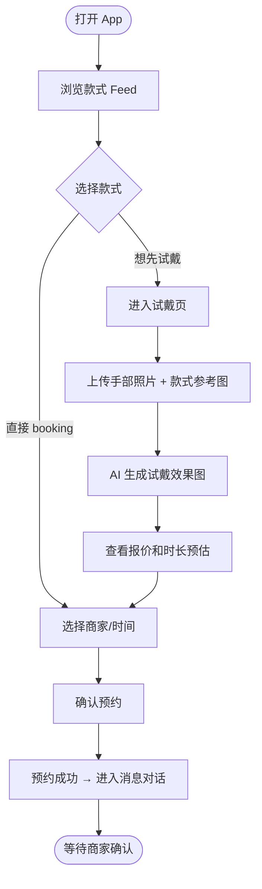
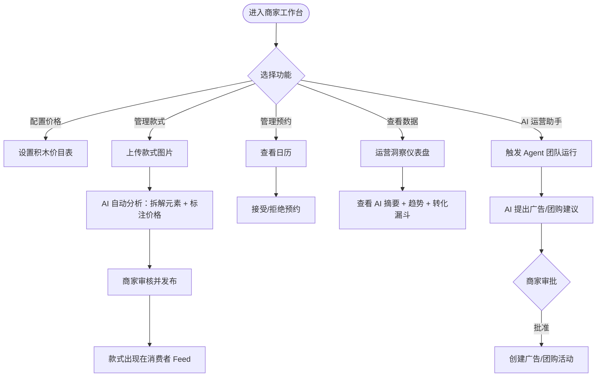
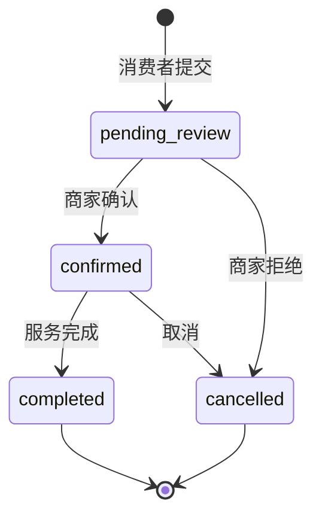
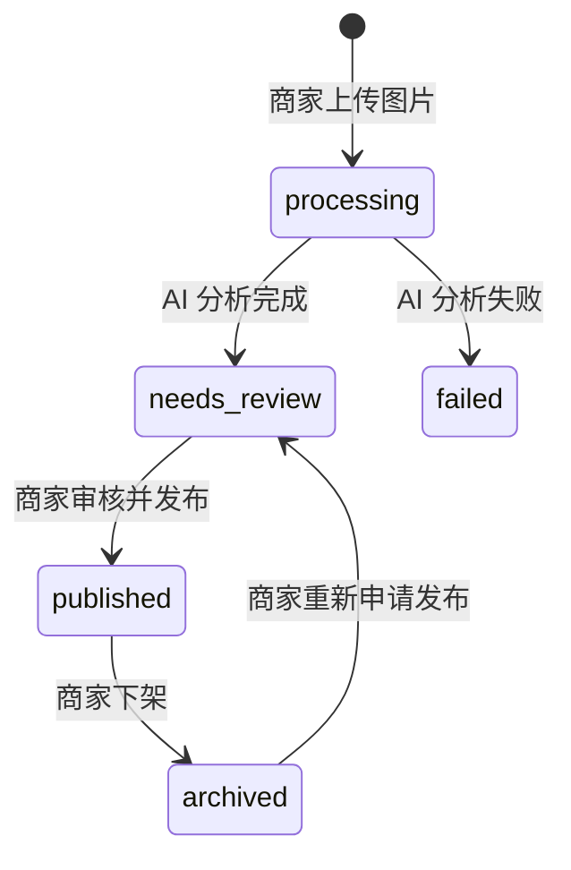

# Nailed-it 产品需求文档

> **阅读指南**
> 本文档面向产品经理、设计师、运营和业务负责人。所有功能均注明当前状态（已实现 / 部分实现 / 规划中）。技术细节请参阅 [TECHNICAL_DESIGN.md](TECHNICAL_DESIGN.md)。信息来源为当前代码仓库（截至 2026-07-14），以代码为准，不以原有 PRD 为准；与旧文档冲突之处已在正文中标注。

---

## 1. 文档信息

| 字段 | 内容 |
|---|---|
| 产品名称 | Nailed-it |
| 文档版本 | 2.0（基于代码仓库审计生成） |
| 文档生成日期 | 2026-07-14 |
| 当前产品阶段 | Demo / 早期验证阶段（单一 demo 商家，无真实用户认证） |
| 文档范围 | 消费者端、商家端、AI 能力、预约与报价系统、运营助手 |
| 信息来源 | 代码仓库（`src/`、`supabase/migrations/`、`agent-service/`）；现有文档仅作参考 |
| 文档维护建议 | 每次迭代后由产品经理更新状态列（已实现 / 部分实现 / 规划中），不合并已废弃的功能描述 |

---

## 2. 产品概述

Nailed-it 是一个面向美甲行业的 B2B2C 平台，连接美甲消费者（C 端）与美甲商家（B 端）。

**平台做什么：**
- 消费者上传美甲参考图 + 手部照片，AI 自动拆解款式元素、生成虚拟试戴效果并给出报价；
- 消费者一键提交预约，系统根据款式时长自动锁定美甲师日历；
- 商家维护款式图库，配置积木式价目表，通过 AI 运营助手团队获得数据洞察与投广/团购建议。

**产品当前阶段：** Demo / 早期验证。无真实用户注册/登录，所有操作绑定单一 demo 商家（Nailed-it Studio）和单一 demo 消费者（Melissa Tan）。

**一句话定位：** AI 驱动的美甲预约与商家运营平台，把"看图报价 + 预约"的人工流程变成秒级自动化。

---

## 3. 产品背景与用户痛点

### 消费者侧

| 痛点 | 说明 | 代码依据 |
|---|---|---|
| 看图效果靠想象 | 客户拿到参考图后不知道上手效果如何 | `/api/ai/try-on` 实现虚拟试戴 |
| 价格不透明 | 报价需人工沟通，等待时间长 | `/api/ai/breakdown` + quote-service |
| 服务时长不透明 | 不知道一次预约需要多久 | `totalDurationMin` 由定价引擎计算 |
| 款式筛选效率低 | 海量款式难以快速找到适合自己的 | skin-match API 按肤色推荐款式 |
| 预约流程割裂 | 试戴图、报价、预约分散在多个渠道 | 试戴 → 预约 路径已在代码中打通 |

### 商家侧

| 痛点 | 说明 | 代码依据 |
|---|---|---|
| 报价依赖人工判断 | 每个款式报价都要手动沟通 | AI 拆解 + 积木定价引擎替代人工 |
| 款式价格配置复杂 | 元素多、组合多、难以维护统一价目表 | 积木模型（catalog_item + merchant_pricing）|
| 款式库维护成本高 | 靠相册人工整理，AI 分析后自动入库 | 商家款式库（merchant_style 工作流） |
| 缺少经营分析工具 | 不知道哪些款式受欢迎、哪里有缺口 | 智能运营洞察仪表盘 |
| 运营决策依赖个人经验 | 投广/团购时机靠感觉 | AI 运营助手团队（agent-service） |

---

## 4. 目标用户与用户角色

> **注：当前代码中无真实认证系统**，角色逻辑为产品方向而非当前实现。

### 4.1 美甲消费者（Customer）

- **核心需求：** 看图试戴、获取报价、快速预约
- **使用场景：** 手机端浏览款式、上传图片试戴、提交预约
- **权限范围（规划中）：** 仅查看自己的预约和消息
- **主要任务：** 浏览款式 → 试戴 → 查看报价 → 选择时间 → 预约

### 4.2 美甲商家（Merchant）

- **核心需求：** 管理款式库、配置价格、处理预约、查看经营数据
- **使用场景：** 电脑/手机端管理工作台
- **权限范围：** 全部商家功能
- **主要任务：** 上传款式 → 配置价格 → 审核 AI 分析 → 管理预约 → 查看数据洞察

### 4.3 美甲师（Technician）

- **核心需求：** 查看自己的预约日历
- **当前状态（部分实现）：** 数据库有 `technicians` 表，调度逻辑完整，但无独立的美甲师登录入口
- **主要任务：** 查看今日/本周预约

### 4.4 平台管理员

- **规划中：** 当前无管理后台，数据操作通过脚本完成

---

## 5. 产品目标与非目标

### 产品目标

**用户价值：**
- 消费者能在 2 分钟内完成从浏览款式到提交预约的全程
- 消费者获得准确的价格和时长预期，无需等待人工报价
- 商家减少客服报价工作量，专注于服务本身

**商业价值：**
- 提高预约转化率（试戴 → 预约）
- 帮助商家发现高转化款式，优化款式库
- 通过 AI 团队自动给出投广/团购建议，提升单店营收

### 非目标（当前版本不解决）

- 多商家消费者发现（平台级款式搜索排名）
- 支付系统集成
- 到店核销与实物兑换
- 商家之间的数据互通
- 用户评价系统
- 美甲师移动端独立 App

---

## 6. 核心用户旅程

### 6.1 消费者旅程（已实现）



**注：** 试戴 → 报价 → 预约链路已实现。消费者身份识别暂为 demo 固定用户（Melissa Tan），无真实登录。

### 6.2 商家旅程（已实现，部分需运营）



---

## 7. 产品信息架构

```
Nailed-it
├── 消费者端（/customer/）
│   ├── 款式 Feed（首页）
│   ├── 款式详情页
│   ├── AI 试戴
│   ├── 肤色匹配推荐
│   ├── 预约流程（选时间 → 确认）
│   ├── 消息与对话
│   └── 个人主页
├── 商家端（/merchant/）
│   ├── 今日概览（merchant home）
│   ├── 款式库（上传、AI 审核、发布）
│   ├── 价格管理（积木式价目表）
│   ├── 团购管理（groupbuy_deal）
│   ├── 广告管理（style_ad_campaign）
│   ├── 日历与预约
│   ├── 消息系统
│   ├── 运营洞察
│   └── AI 运营助手团队
├── AI 能力层
│   ├── 图片识别（nail-recognition）
│   ├── 款式拆解（breakdown）
│   ├── 虚拟试戴（try-on）
│   ├── 肤色匹配（skin-match）
│   ├── 款式拼贴生成（collage-generate）
│   ├── 趋势款推荐（trending-styles）
│   └── 运营洞察摘要（insights-summary）
├── 报价引擎（积木定价模型）
├── 预约系统（含冲突检测）
├── 消息系统
├── 运营分析系统（intelligence layer）
└── AI 运营助手团队（Python agent-service）
```

---

## 8. 功能清单与当前状态

| 模块 | 功能 | 用户角色 | 功能描述 | 当前状态 | 代码依据 | 优先级 |
|---|---|---|---|---|---|---|
| 消费者端 | 款式 Feed 浏览 | 消费者 | 浏览商家发布的美甲款式图片 | 已实现 | `src/app/customer/home/` | P0 |
| 消费者端 | 款式详情 | 消费者 | 查看款式信息、报价、发起试戴或预约 | 已实现 | `src/app/customer/style/[id]/` | P0 |
| 消费者端 | AI 虚拟试戴 | 消费者 | 上传手图 + 款式图，AI 生成合成效果 | 已实现 | `src/app/customer/try-on/` + `/api/ai/try-on` | P0 |
| 消费者端 | 肤色匹配推荐 | 消费者 | 上传手图，AI 按肤色推荐最适款式 | 已实现 | `src/app/customer/hand-match/` + `/api/ai/skin-match` | P1 |
| 消费者端 | 款式拼贴生成 | 消费者 | 选择元素，AI 生成拼贴参考图 | 已实现 | `/api/ai/collage-generate` | P1 |
| 消费者端 | 在线预约 | 消费者 | 选择时间/美甲师，提交预约 | 已实现 | `src/app/customer/booking/` | P0 |
| 消费者端 | 消息对话 | 消费者 | 与商家实时沟通 | 已实现 | `src/app/customer/messages/` | P1 |
| 消费者端 | 个人主页 | 消费者 | 查看个人信息（当前为 demo 静态页） | 部分实现 | `src/app/customer/profile/` | P2 |
| 消费者端 | 用户注册/登录 | 消费者 | 账号体系 | 规划中 | 代码中有明确 TODO 注释 | P0 |
| 商家端 | 今日概览 | 商家 | 今日预约、活跃活动、Agent 动态 | 已实现 | `src/app/merchant/` | P0 |
| 商家端 | 款式库管理 | 商家 | 上传图片 → AI 分析 → 审核 → 发布 | 已实现 | `src/app/merchant/styles/` | P0 |
| 商家端 | 款式广告 | 商家 | 为款式创建广告投放活动 | 已实现 | `src/app/merchant/styles/[id]/ads/` + `style_ad_campaign` 表 | P1 |
| 商家端 | 价格管理 | 商家 | 配置积木式价目表 | 已实现 | `src/app/merchant/manage/` | P0 |
| 商家端 | 团购管理 | 商家 | 创建/编辑/发布团购套餐 | 已实现 | `groupbuy_deal` 表 + GroupbuyPanel | P1 |
| 商家端 | 日历与预约管理 | 商家 | 查看日历、确认/拒绝预约 | 已实现 | `src/app/merchant/calendar/` + `booking/[id]/` | P0 |
| 商家端 | 消息系统 | 商家 | 与消费者沟通 | 已实现 | `src/app/merchant/messages/` | P1 |
| 商家端 | 运营洞察 | 商家 | 展示试戴/点击/预约转化漏斗、需求趋势 | 已实现 | `src/app/merchant/insights/` | P1 |
| 商家端 | AI 运营助手团队 | 商家 | Python agent 团队生成投广/团购/选品建议 | 已实现 | `src/app/merchant/agents/` + `agent-service/` | P1 |
| AI 能力 | 款式元素拆解 | 系统 | 从图片识别甲型、颜色、工艺、装饰等元素 | 已实现 | `src/nail-ai/breakdown.ts` | P0 |
| AI 能力 | 报价计算 | 系统 | 拆解结果 → 商家定价配置 → 总价和时长 | 已实现 | `src/lib/services/quote-service.ts` | P0 |
| AI 能力 | 趋势款推荐 | 系统 | AI 给出当前流行款式列表 | 已实现 | `src/nail-ai/trending-styles.ts` | P2 |
| AI 能力 | 运营洞察摘要 | 商家 | AI 用自然语言解读指标数据 | 已实现 | `src/nail-ai/insights-summary.ts` | P1 |
| 系统 | 团购消费者入口 | 消费者 | 消费者发现和购买团购套餐 | 规划中 | 商家端有 UI，消费者端无入口 | P1 |
| 系统 | 平台管理后台 | 平台管理员 | 用户管理、商家审核、数据治理 | 规划中 | 无任何实现 | P2 |

---

## 9. 核心功能需求

### 9.1 AI 美甲图片拆解

**功能目的：** 从一张美甲参考图中识别所有可计费的服务元素，并映射到商家价目表，实现自动报价。

**使用者：** 消费者（间接）、系统自动调用

**触发入口：** 消费者在试戴页或款式详情页上传参考图时；商家上传款式图片进入 AI 分析流程时

**前置条件：** 有效的图片文件（PNG/JPEG/WEBP/HEIC/HEIF）；`ARK_API_KEY` 或 `OPENROUTER_API_KEY` 已配置

**主流程：**
1. 前端将图片转为 base64，调用 `POST /api/ai/breakdown`
2. AI 模型（Ark 或 OpenRouter）从图片中识别：服务模块、可计费组件、工序、视觉属性、复杂度等级、款式标签
3. 系统将识别到的 `catalog_item` ID 映射到商家价目表，计算总价和时长
4. 同步调用款式命名 API，为本次拆解建议款式名称
5. 返回结构化结果：拆解元素 + 总价 + 总时长 + 建议款式名

**异常流程：**
- AI 输出不符合 JSON Schema：返回 `provider_error`（重试一次后报错，用户需手动描述需求）
- 图片无法识别：返回 `provider_error`
- 商家未配置某元素的价格：整个报价失败（fail-closed），提示"需要商家配置"

**业务规则：**
- 价格优先级：商家覆盖价格 > 平台目录默认价格 > 未配置（禁止预约）
- 当前版本报价绑定 demo 商家（`demoMerchantId`），不支持多商家选择（P0 技术债）
- 图片元素为 AI 识别结果，消费者可在确认页手动调整后重新计算报价

**当前实现状态：** 已实现

---

### 9.2 AI 美甲虚拟试戴

**功能目的：** 让消费者在预约前直观看到美甲效果，降低预约决策门槛。

**使用者：** 消费者

**触发入口：** 消费者端 `/customer/try-on` 页面；从款式详情页进入时预填款式图

**前置条件：** 需要两张图片：手部照片 + 美甲参考图；`ARK_API_KEY` 或 `OPENROUTER_API_KEY` 已配置

**主流程：**
1. 消费者上传手部照片（或从相机拍照）
2. 消费者上传或选择美甲参考图
3. 可选：消费者输入文字定制要求（最多 300 字符）
4. 前端调用 `POST /api/ai/try-on`，两张图 base64 编码传输
5. 服务端先做图像验证（是否为手图 + 是否为美甲图），无效图片直接返回错误
6. 调用 Ark 图像生成模型，应用试戴 prompt（含精准手指映射规则）
7. 返回生成图 base64
8. 前端展示效果图，提供"开始预约"按钮

**异常流程：**
- 手图不合法（如上传了风景图）：返回中文错误提示，引导重新上传
- 款式图不合法：返回错误提示
- 文字备注与美甲无关：返回 `invalid_comment` 错误
- 生成失败：返回 `provider_error`，提示用户重试

**输出：** 生成图 base64（PNG 格式），存于浏览器内存/localStorage，不持久化到服务端

**当前实现状态：** 已实现

**隐私说明：** 生成图仅存于客户端，服务端不保留用户手部图片（待确认：是否有日志留存）

---

### 9.3 智能报价与预计时长

**功能目的：** 根据款式元素自动计算消费者应支付的价格和需要的服务时间。

**积木模型（核心业务规则）：**

```
总价 = Σ（各 catalog_item 单价 × 数量）
总时长 = Σ（影响预约时长的 catalog_item 时长 × 数量）

其中：
- per_finger/per_piece 单元：时长 × 数量（5 根手绘 = 5 倍时间）
- per_set/fixed/included 单元：时长计一次
```

**价格来源优先级（已实现）：**
1. 商家为该 catalog_item 配置的覆盖价格
2. 平台目录默认价格（`catalog_item.default_price_cents`）
3. 未配置 → 禁止预约（不显示 ¥0）

**用户修改识别结果后的处理：** 调用 `/api/ai/breakdown` 后消费者可在 UI 中编辑识别结果，编辑后前端重新计算报价（基于 DOM 状态，不再调用 AI）

**报价性质：** 预估报价（estimate），最终价格在确认页由服务端重新计算，浏览器总价不被信任

**当前实现状态：** 已实现

---

### 9.4 预约系统

**功能目的：** 消费者完成报价后，选择美甲师和服务时间，系统保证不双重预约。

**主流程：**
1. 系统根据服务时长，查询商家指定日期范围内的可用时段（向后 30 天）
2. 展示每天可用美甲师列表（基于工作计划 + 已有预约排除）
3. 消费者选择日期、时间、美甲师
4. 确认页展示：款式 + 价格 + 时长 + 美甲师 + 时间
5. 提交后，服务端通过原子 RPC（`create_booking_with_thread`）同时创建预约 + 消息线程
6. 消费者跳转到消息页，看到系统自动发送的预约确认消息

**冲突检测（已实现）：**
- 数据库层：GiST exclusion constraint 在 `(technician_id, tstzrange)` 上防止时间段重叠
- 应用层：`findAvailable` 函数在 DB 查询前预检
- 预约与消息线程同事务提交，失败则全部回滚

**预约状态机：**



**当前实现状态：** 已实现（完整链路）

**未实现：** 消费者主动取消/改期（无对应 UI 和 API）

---

### 9.5 商家价格管理

**功能目的：** 让商家灵活配置每个美甲元素的价格和时长，支持高度个性化定价。

**定价维度（已实现）：**
- 服务模块（如：硬胶基础服务）
- 工序（如：卸甲）
- 可计费组件（如：手绘 1-3 根、手绘 4-5 根）
- 视觉效果（颜色、工艺）
- 复杂度等级
- 款式标签

**定价单位：** `fixed`（固定）/ `included`（包含）/ `per_finger`（每根）/ `per_level`（每级）/ `per_piece`（每件）/ `per_set`（整套）/ `tag_only`（仅标注）

**商家配置流程：** 进入 `/merchant/manage`，逐项设置价格和时长，保存后立即生效

**默认值机制：** 商家未设置的项目使用平台目录默认值；若无默认值且商家也未设置，则该服务不可预约

**当前实现状态：** 已实现

---

### 9.6 商家款式图库

**功能目的：** 商家维护自己的款式展示库，为消费者提供真实参考，同时形成可被 AI 分析的数据资产。

**款式生命周期（已实现）：**



**AI 分析内容：**
- 自动识别款式元素（调用 `breakdown` 能力）
- 生成 `catalog_breakdown`（与报价系统的对接键）
- 生成 `discovery_facets`（用于 Feed 筛选和肤色匹配）
- 生成预览价格和时长

**发布条件：** 已配置预览价格、预览时长，且商家确认了 `catalog_breakdown`

**当前实现状态：** 已实现

---

### 9.7 团购套餐

**功能目的：** 让商家创建折扣套餐，吸引新客或提升空闲时段产能。

**商家端（已实现）：**
- 创建/编辑团购套餐，设置原价和团购价
- 配置关联服务（从 catalog_item 选择）
- 设置有效期、销售渠道、叠加规则、购买限制
- 发布/下架套餐
- 通过 AI 运营助手自动创建建议套餐（agent-service → coupon lane）

**消费者端（规划中）：** 当前消费者端无入口查看或购买团购套餐。商家端已有完整数据模型（`groupbuy_deal` + `groupbuy_deal_item` 表）和 UI。

**当前实现状态：** 商家端已实现；消费者购买链路规划中

---

### 9.8 AI 运营助手

**功能目的：** 代替商家做数据分析和周期性运营决策，主动给出可执行的投广/团购/选品建议。

**架构（已实现）：**
- 独立 Python 服务（`agent-service/`）
- 包含多个专业 Agent：数分（Insight）、趋势选品（Trend）、决策（Decision）、广告执行（Ad）、团购执行（Coupon）、选品陈列（Catalog）、用户运营（Customer Ops）、监测（Monitor）
- 动态编排：Orchestrator Agent 根据当前业务状态决定本轮激活哪些 Lane

**数据来源（已实现）：**
- 运营洞察（`/api/agent/briefing`）：试戴/点击/预约等指标
- 商业决策输入（`/api/agent/decisions`）：每款式的漏斗得分、广告/团购经济性
- 款式库（`/api/agent/styles`）
- 顾客画像（`/api/agent/customers`）

**建议类型：**
- 投放广告（`place_ad`）：为指定款式创建广告活动
- 创建团购（`set_group_buy_coupon`）：创建折扣套餐
- 上架/下架款式（`list_style` / `delist_style`）

**商家控制（已实现）：**
- 商家可配置自动运行频率（每天/每2天/每周等）
- 商家可手动触发"生成本周经营计划"
- 所有建议对商家可见，高风险操作需商家审批（基于风险等级 `reversible` / `irreversible`）
- 商家可配置本周目标预约量和经营重点

**记忆系统（已实现）：**
- 跨轮次记忆（`agent_memory` 表）：记录上一轮广告/团购的实测效果，下一轮决策参考
- 记忆分类：`action_outcome`（动作实测结果）、`calibration`（预测偏差）、`round_verdict`（轮次结论）、`merchant_preference`（商家偏好）

**当前实现状态：** 已实现（演示阶段）

---

## 10. 业务规则

| 规则 | 内容 | 状态 |
|---|---|---|
| 报价计算 | 总价 = Σ 单价×数量；时长依单位类型计算（per_finger/per_piece 线性累加，其他计一次） | 已实现 |
| 报价 fail-closed | 任何必须配置的 catalog_item 缺价，整个报价失败，不允许 ¥0 预约 | 已实现 |
| 预约冲突 | DB GiST exclusion constraint 防止同一美甲师同一时段被双重预约 | 已实现 |
| 图片格式 | 支持 PNG/JPEG/WEBP/HEIC/HEIF；服务端有格式验证 | 已实现 |
| 图片大小限制 | try-on API 无显式大小检查；skin-match API 限制约 9MB（base64 约 12M 字符） | 部分实现 |
| 款式发布条件 | 必须有 preview_price_cents、preview_duration_min 和 published_at | 已实现（DB 约束） |
| AI 失败降级 | insights-summary 失败时使用确定性规则摘要（`insights-fallback.ts`）；try-on 失败返回错误，无降级生成 | 部分实现 |
| 价格精度 | 所有价格以分（cents）整数存储；展示时除以 100 | 已实现 |
| 认证边界 | 当前无认证，所有操作视为 demo 用户/商家 | 技术债（P0） |
| Agent 动作风险 | `reversible` 动作直接执行；`irreversible` 动作状态为 `proposed`，等待商家批准 | TBD（代码中 risk 字段存在，UI 审批流程部分实现） |
| 团购价格 | original_price_cents 和 deal_price_cents 均以分存储 | 已实现 |

---

## 11. 验收标准

### 11.1 AI 试戴

- **正常路径：** 上传有效手图 + 有效美甲图 → 15 秒内返回合成效果图，图中手部形态不变
- **异常路径：** 上传非手图（如食物图片）→ 返回中文错误提示，不调用生成模型
- **边界情况：** 手图中有多只手 → AI 聚焦最清晰的那只手
- **权限场景：** API 无认证（待修复）
- **空数据：** 未上传任何图片 → 按钮不可点击

### 11.2 智能报价

- **正常路径：** AI 识别出所有元素，商家已配置所有价格 → 显示总价和总时长
- **异常路径：** 商家未配置某元素价格 → 报错"无法报价，请联系商家"，而非显示 ¥0
- **边界情况：** 消费者修改 AI 识别结果后 → 前端实时重新计算报价

### 11.3 预约提交

- **正常路径：** 选择时间 → 确认 → 商家接受 → 双方消息线程同时创建
- **异常路径：** 并发预约（两个消费者同时抢同一时段）→ 第二个提交失败，返回 `booking_overlap`
- **边界情况：** 款式时长 = 0 → 系统拒绝创建预约（返回 `zero_duration`）

### 11.4 商家价格配置

- **正常路径：** 修改价格后保存 → 下一次报价计算使用新价格
- **空数据：** 商家未配置任何价格 → 使用平台目录默认价格（若无则报错）

---

## 12. 数据指标与埋点建议

### 当前已有埋点

| 事件名 | 触发时机 | 代码依据 |
|---|---|---|
| `style_impression` | 款式在 Feed 中展示 | `src/features/analytics/track.ts` |
| `style_card_click` | 消费者点击款式卡片 | 同上 |
| `style_detail_view` | 消费者打开款式详情页 | 同上 |
| `style_save` | 消费者收藏款式 | 同上 |
| `search_submitted` | 提交搜索 | 同上 |
| `search_no_result` | 搜索无结果 | 同上 |
| `try_on_completed` | 试戴生成完成 | 同上 |
| `booking_confirmed` | 预约提交成功 | `src/lib/actions/booking-actions.ts` |
| `recommended_style_sent` | Agent 推荐款式发送给顾客 | 同上 |

### 建议新增埋点（To-Be）

| 事件名 | 触发时机 | 用途 |
|---|---|---|
| `try_on_error` | 试戴失败 | 监控 AI 成功率 |
| `breakdown_started` / `breakdown_completed` | AI 拆解启动/完成 | 监控延迟 |
| `quote_viewed` | 报价展示给消费者 | 漏斗分析 |
| `booking_started` | 进入预约流程 | 转化分析 |
| `recognition_edited` | 消费者修改 AI 识别结果 | 识别准确性分析 |
| `skin_match_completed` | 肤色匹配完成 | 功能使用率 |
| `agent_round_triggered` | Agent 团队运行触发 | Agent 运行频率监控 |
| `agent_action_approved` / `rejected` | 商家审批 Agent 动作 | 建议采纳率 |

---

## 13. 权限与隐私要求

> **重要：当前代码无任何用户认证系统。** 以下为产品应达到的目标状态，非当前状态。

| 数据类型 | 当前实现 | 目标要求 |
|---|---|---|
| 用户手部照片 | 以 base64 临时传输，服务端不保留（待确认日志） | 仅用于 AI 处理，不持久化，不被商家看到 |
| 试戴生成图 | 存于客户端 memory/store，不上传服务器 | 用户可手动保存；超出会话自动清除 |
| 商家款式图片 | 存于 Supabase Storage，分 private（原图）和 public（发布图）Bucket | 原图仅商家可见；发布图公开 |
| 消费者预约和消息 | 当前无 RLS 隔离（代码中明确注释"no auth yet"） | 需加入租户隔离 |
| 运营数据（analytics_events） | service_role 写入，无 anon 策略 | 商家只能看到自己的数据 |
| AI 第三方数据传输 | 图片以 base64 发送至 Volcengine Ark / OpenRouter | 需明确告知用户，并在隐私政策中说明 |
| 用户删除权利 | 待确认 | 用户可申请删除历史预约和消息 |

---

## 14. 风险与依赖

| 风险 | 影响 | 当前状态 |
|---|---|---|
| AI 输出不稳定 | 试戴效果差、报价识别错误 → 用户流失 | 已有基本错误处理；无重试降级 |
| 图片生成延迟 | 试戴等待时间过长（可能 >10 秒）→ 用户放弃 | 有加载状态，无进度估算 |
| AI 成本 | 高频使用下图像生成成本显著 | 无成本监控；无每用户限流 |
| 报价准确性 | 商家未配置价格 → 无法报价 | fail-closed 机制存在 |
| 预约冲突（极端并发）| 高并发下 DB constraint 会拒绝后提交者 | 已有 GiST exclusion constraint |
| 无认证系统 | 任何人可操作任何数据 | P0 技术债，需尽快修复 |
| Volcengine Ark 依赖 | Ark 故障 → 所有 AI 功能不可用 | 部分功能可 fallback 到 OpenRouter |
| Supabase 依赖 | Supabase 故障 → 数据不可用 | 本地有 memory mock，生产无降级 |
| 图片版权 | 用户上传他人图片作为参考 | 无版权检测 |
| 移动端性能 | base64 大图可能导致内存压力 | 无图片压缩逻辑 |
| Python agent-service 独立部署 | 需单独部署和维护 | 无 CI/CD 说明 |

---

## 15. 版本规划建议

> **注意：** 以下为基于代码成熟度的**建议**，不是已确认的产品路线图。

| 阶段 | 内容 |
|---|---|
| **MVP（当前）** | 完整试戴 → 报价 → 预约链路；商家款式库和价格配置；基础运营洞察；AI 运营助手（demo 阶段） |
| **V1（建议）** | 用户注册/登录；消费者预约历史；团购消费者入口；多商家选择 |
| **V1.5（建议）** | 预约取消/改期；商家多成员（美甲师独立账号）；图片压缩优化；AI 成本监控 |
| **后续版本（建议）** | 支付系统；评价系统；平台管理后台；SEO/小程序入口；推荐算法升级 |

---

## 16. 待确认问题

1. **认证系统选型：** 是否使用 Supabase Auth？还是自建？何时引入？
2. **多商家模式：** 消费者是否可以在多个商家间选择？当前报价硬编码 `demoMerchantId`，改造范围如何？
3. **用户手部照片是否有服务端日志？** 需要确认 Ark/OpenRouter 是否会留存发送的图片。
4. **团购消费者入口：** 消费者如何发现并购买团购套餐？是在 Feed 中混排，还是单独入口？
5. **Agent 动作审批 UI：** `irreversible` 动作的审批界面是否已完整实现？还是仅有数据结构？
6. **价格货币：** 当前代码中货币配置为 CNY，但部分代码默认 SGD；是否需要支持多货币？
7. **离线/弱网支持：** 移动端是否需要考虑弱网下的用户体验？
8. **图片版权声明：** 用户上传参考图时，是否需要版权授权提示？
9. **数据保留政策：** 预约数据、消息、图片各保留多久？是否需要支持 GDPR 级别的数据删除？
10. **agent-service 部署方式：** Python agent-service 与 Next.js app 如何一起部署？是否已有 Docker / CI 方案？
