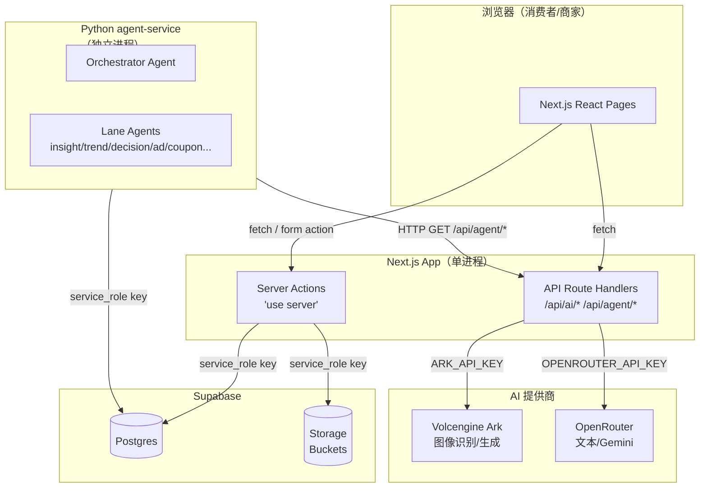
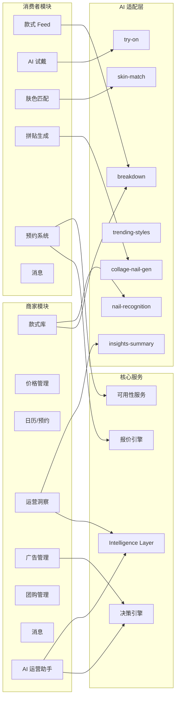
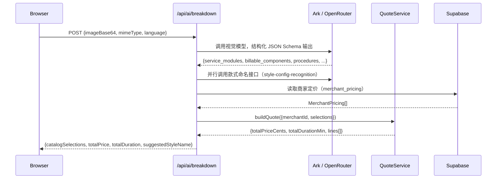
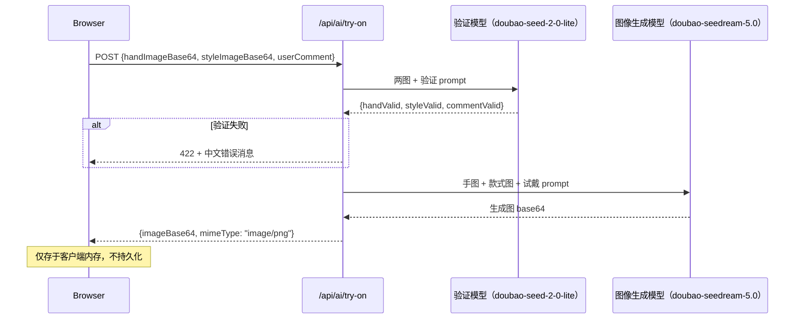
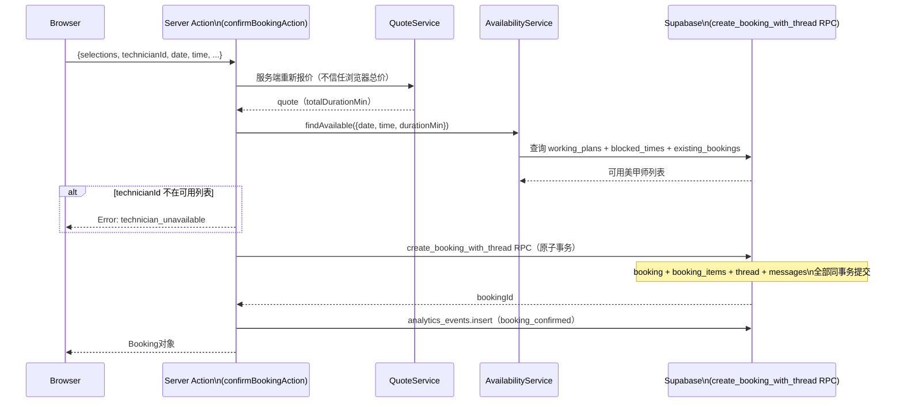
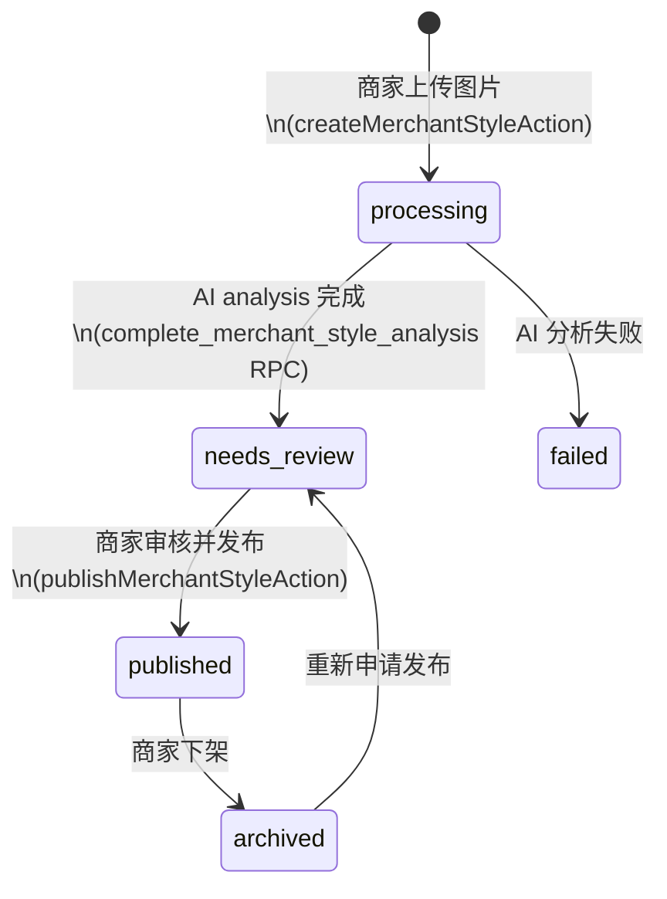
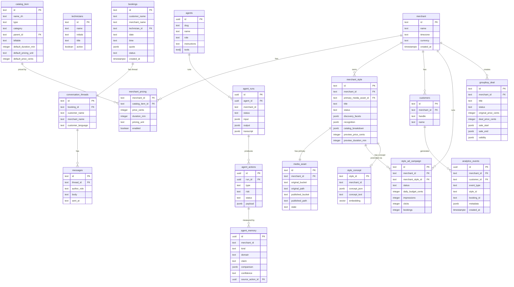

# Nailed-it 技术设计文档

> **阅读指南**
> 本文档面向前端、后端、AI、数据和测试工程师。所有关键结论标注代码路径。As-Is（当前实现）与 To-Be（架构建议）严格分开，建议不与实现混淆。产品背景请参阅 [PRD.md](PRD.md)。

---

## 1. 文档信息与范围

| 字段 | 内容 |
|---|---|
| 文档版本 | 1.0 |
| 生成时间 | 2026-07-15 |
| 仓库最新 commit | `c111a3a` （2026-07-14，移动端 UI 调整） |
| 覆盖范围 | Next.js Web App、Supabase DB/Storage、AI 模块、Python agent-service、数据模型、API 文档 |
| 不覆盖范围 | Supabase 平台管理、Volcengine Ark 平台配置、Pinterest 数据抓取脚本（`scripts/pinterest-auth.ts`） |
| 事实来源 | `src/`、`supabase/migrations/`、`agent-service/`、`.env.example`；已有 docs 仅作参考 |
| 已知限制 | 当前无用户认证；单一 demo 商家/消费者；Python agent-service 独立进程不在 Next.js 进程内 |

---

## 2. 系统概览

Nailed-it 是一个 Next.js 全栈 Web 应用 + 独立 Python AI Agent 服务的双进程系统。

- **Web App**：Next.js 15 App Router，同时承载前端 UI 和 API 路由（Route Handlers）、Server Actions
- **Python agent-service**：独立进程，通过 HTTP 调用 Next.js 提供的 `/api/agent/*` 接口获取上下文，通过 Supabase 服务端客户端写入 `agent_runs`、`agent_actions` 等表



**当前部署方式**：本地 `./dev`（Next.js dev server）；agent-service 单独 `python -m nailed_agents`；生产部署方式 TBD（有 `.cozeproj/` 部署脚本，但主体为 Next.js Vercel/容器部署，待确认）。

---

## 3. 技术栈

| 层级 | 技术 | 版本 | 用途 | 代码依据 |
|---|---|---|---|---|
| 框架 | Next.js | ^15.0.0 | SSR + API Routes + Server Actions | `package.json` |
| 语言（前端/后端） | TypeScript | ^5.7.2 | 全栈类型安全 | `package.json` |
| 运行时 | React | ^19.0.0 | UI 渲染 | `package.json` |
| UI 组件库 | Radix UI Primitives | ^1.x-^2.x | Dialog、Tabs、Toast 等无样式组件 | `package.json`（ADR-0002） |
| 抽屉组件 | Vaul | ^1.1.2 | 移动端底部抽屉 | `package.json` |
| 状态管理 | React useState / localStorage store | — | 无全局状态管理库 | `src/domain/*-store.ts` |
| 数据库 | Supabase Postgres | — | 关系数据、RLS | `supabase/migrations/` |
| 向量数据库 | pgvector（Supabase 扩展） | — | style_concept embedding（1024d Cohere） | `migration 0026` |
| ORM | Supabase JS Client（PostgREST） | ^2.107.0 | DB CRUD | `src/lib/repositories/supabase/` |
| 对象存储 | Supabase Storage | — | 款式图片（原图/发布图） | `src/lib/storage/` |
| AI 提供商（图像） | Volcengine Ark | — | 图像生成、视觉理解 | `src/nail-ai/openrouter.ts` |
| AI 提供商（文本/图像备选） | OpenRouter + Gemini | — | insights-summary、try-on 备选 | `src/nail-ai/*.ts` |
| Python AI Agent | OpenRouter / Anthropic SDK | — | 商家运营助手团队 | `agent-service/` |
| 包管理 | pnpm | 9.15.9 | 依赖管理 | `package.json` |
| 单元/集成测试 | Vitest | ^2.1.8 | 单元测试，jsdom 环境 | `package.json` |
| E2E 测试 | Playwright | ^1.60.0 | 端对端测试 | `package.json` |
| 国际化 | 自研 i18n context | — | zh-CN / en 双语 | `src/i18n/` |

---

## 4. 仓库结构

```
Nailed-it/
├── src/
│   ├── app/                   # Next.js App Router 路由
│   │   ├── customer/          # 消费者端页面
│   │   ├── merchant/          # 商家端页面
│   │   ├── api/               # Route Handlers（AI + Agent API）
│   │   ├── privacy/           # 隐私政策页
│   │   ├── dev/               # 内部调试页
│   │   └── layout.tsx         # 全局布局
│   ├── components/            # 共享 UI 组件（MobileLayout、Button、Toast…）
│   ├── features/              # 按角色组织的业务组件（customer/、merchant/、analytics/）
│   ├── domain/                # 纯 TypeScript 业务逻辑（无副作用，可测试）
│   │   ├── intelligence/      # 运营洞察计算（compute-on-read）
│   │   ├── decision/          # 商业决策计算（ad economics、funnel）
│   │   └── *.ts               # 其他领域模型
│   ├── nail-ai/               # AI 适配层（breakdown、try-on、skin-match…）
│   ├── lib/
│   │   ├── actions/           # Next.js Server Actions（唯一 UI → DB 通道）
│   │   ├── services/          # 业务服务（quoteService、bookingService、availabilityService…）
│   │   ├── repositories/      # 存储抽象（types.ts + memory/ + supabase/）
│   │   ├── storage/           # 图片存储抽象（memory + Supabase）
│   │   └── db/client.ts       # Supabase 服务端客户端（server-only）
│   ├── i18n/                  # 国际化（context、messages、types）
│   ├── data/                  # 客户端数据（glossary、currency-store）
│   └── mock/                  # 种子/演示数据（in-memory repo 使用）
├── supabase/migrations/       # 33 个 SQL 迁移（按序应用）
├── agent-service/             # Python AI Agent 服务（独立进程）
│   ├── nailed_agents/         # 核心模块（orchestrator、runner、tools…）
│   ├── skills/                # Agent 系统提示（orchestrator.md、insight.md…）
│   ├── eval/                  # Agent 评测脚本
│   └── tests/                 # Python 单元测试
├── AI试戴测试/                 # 试戴模型评测数据和脚本（Python）
├── docs/                      # 文档（PRD、ADR、架构、计划）
├── scripts/                   # 管理脚本（seed、backfill、preflight）
├── e2e/                       # Playwright E2E 测试
└── .env.example               # 环境变量模板
```

**关键原则：**
- `src/lib/actions/` 是 UI 与数据库之间的**唯一通道**，不允许直接 import Supabase repo
- `src/domain/` 为纯函数，不引用任何 Next.js / Supabase 依赖
- `src/lib/repositories/index.ts` 的 `getRepositories()` 工厂根据环境变量决定返回 Supabase 实现还是 memory 实现

---

## 5. 系统边界与模块划分



---

## 6. 核心数据流

### 6.1 AI 图片拆解流程（已实现）



**关键文件：** `src/app/api/ai/breakdown/route.ts`、`src/nail-ai/breakdown.ts`、`src/lib/services/quote-service.ts`

### 6.2 AI 虚拟试戴流程（已实现）



**关键文件：** `src/app/api/ai/try-on/route.ts`、`src/nail-ai/try-on.ts`

### 6.3 报价流程（已实现）

```
AI 识别结果（CatalogSelection[]）
→ CatalogRepository.list()  // 获取全量 catalog_item（含默认价格）
→ MerchantPricingRepository.listByMerchant()  // 获取商家覆盖价格
→ resolveEffectivePricing()  // 三级优先级：商家覆盖 > catalog 默认 > unresolved
→ QuoteService.buildQuote()  // 逐行计算：unitPrice × quantity，时长按单位类型
→ 返回 {lines[], totalPriceCents, totalDurationMin}
```

**fail-closed 规则：** 任何必须配置但未配置价格的 `catalog_item` 导致整个 `buildQuote` 抛出 `unresolved_pricing`，而非返回 ¥0。

**关键文件：** `src/domain/pricing-resolver.ts`、`src/lib/services/quote-service.ts`

### 6.4 预约流程（已实现）



**关键文件：** `src/lib/actions/booking-actions.ts`、`src/lib/services/booking-service.ts`、`supabase/migrations/0010_booking_thread_rpc.sql`

### 6.5 商家款式上传分析流程（已实现）



**AI 分析原子 RPC：** `complete_merchant_style_analysis`（`migration 0016`）在单一事务中更新 `merchant_style.status`、`catalog_breakdown`、`discovery_facets`、`recognition`，防止竞态重复分析（通过乐观锁 `for update`）。

**关键文件：** `src/lib/services/merchant-style-service.ts`、`src/lib/actions/merchant-style-actions.ts`

---

## 7. 数据模型

### 核心实体关系图



### 关键实体说明

| 实体 | 主键类型 | 状态字段 | 重要 JSONB 字段 | 数据生命周期 |
|---|---|---|---|---|
| `merchant_style` | text | `status`（processing/needs_review/published/archived/failed） | `catalog_breakdown`、`discovery_facets`、`recognition` | 持久，archived 后可重新发布 |
| `bookings` | text | `status`（pending_review/confirmed/completed/cancelled） | `quote`（价格快照）、`recognition`（AI 结果快照） | 持久，为历史记录保留 |
| `analytics_events` | uuid | — | `metadata` | 持久，compute-on-read；建议设 TTL（待确认） |
| `agent_memory` | uuid | — | `comparison`（prediction vs measured）、`applicability` | 有 TTL（30 天过期；`merchant_preference` 更长） |
| `style_concept` | text（style_id） | — | `concept_json`（结构化属性）、`embedding`（1024d） | 随款式更新重新 enrich |
| `agent_actions` | uuid | `status`（applied/undone/proposed/approved） | `payload`（操作参数） | 持久，为审计保留 |

---

## 8. API 文档

### 8.1 AI 相关接口

| Method | Path | 功能 | 鉴权 | 代码路径 |
|---|---|---|---|---|
| POST | `/api/ai/breakdown` | 图片元素拆解 + 报价 | 无（**P0 风险**） | `src/app/api/ai/breakdown/route.ts` |
| POST | `/api/ai/try-on` | 虚拟试戴图像生成 | 无（**P0 风险**） | `src/app/api/ai/try-on/route.ts` |
| POST | `/api/ai/recognize-nail-style` | 款式视觉识别 | 无 | `src/app/api/ai/recognize-nail-style/route.ts` |
| POST | `/api/ai/collage-generate` | 款式拼贴生成 | 无 | `src/app/api/ai/collage-generate/route.ts` |
| POST | `/api/ai/skin-match` | 肤色匹配款式推荐 | 无 | `src/app/api/ai/skin-match/route.ts` |
| GET | `/api/ai/trending-styles` | AI 趋势款推荐 | 无 | `src/app/api/ai/trending-styles/route.ts` |

### 8.2 Agent 上下文接口（供 Python agent-service 调用）

| Method | Path | 功能 | 鉴权 | 代码路径 |
|---|---|---|---|---|
| GET | `/api/agent/briefing?rangeDays=7` | 运营指标摘要（intelligence layer） | 无 | `src/app/api/agent/briefing/route.ts` |
| GET | `/api/agent/decisions` | 决策引擎输出（每款式得分/信号） | 无 | `src/app/api/agent/decisions/route.ts` |
| GET | `/api/agent/customers` | 顾客洞察数据 | 无 | `src/app/api/agent/customers/route.ts` |
| GET | `/api/agent/styles` | 商家款式列表 | 无 | `src/app/api/agent/styles/route.ts` |
| POST | `/api/agent/propose-ad` | 执行投广动作 | 无 | `src/app/api/agent/propose-ad/route.ts` |
| POST | `/api/agent/propose-groupbuy` | 执行团购动作 | 无 | `src/app/api/agent/propose-groupbuy/route.ts` |

### 8.3 核心接口详情

#### POST `/api/ai/try-on`

**Request：**
```json
{
  "handImageBase64": "<base64>",
  "handMimeType": "image/jpeg",
  "styleImageBase64": "<base64>",
  "styleMimeType": "image/jpeg",
  "userComment": "我想要更长的甲形"
}
```

**Response（200）：**
```json
{
  "imageBase64": "<base64 PNG>",
  "mimeType": "image/png"
}
```

**错误响应：**

| HTTP 状态 | code | 触发条件 |
|---|---|---|
| 422 | `invalid_input` | 手图或款式图不合法 |
| 422 | `invalid_comment` | 用户备注与美甲无关 |
| 500 | `missing_config` | ARK_API_KEY 未配置 |
| 502 | `provider_error` | Ark/OpenRouter 请求失败 |

**限制：** 图片以 base64 传输，单次请求 payload 可能达数 MB；无图片压缩；无速率限制。

#### POST `/api/ai/breakdown`

**Request：**
```json
{
  "imageBase64": "<base64>",
  "mimeType": "image/jpeg",
  "language": "zh-CN"
}
```

**Response（200）：**
```json
{
  "catalogSelections": [{"catalogItemId": "gel-base-coat", "quantity": 1}],
  "totalPrice": 158,
  "totalDuration": 90,
  "suggestedStyleName": "梦幻猫眼",
  "glossaryItems": [...]
}
```

**注意：** 当前硬编码 `demoMerchantId` 用于报价，不支持多商家选择。

---

## 9. AI 集成设计

### 9.1 AI Provider 路由逻辑

`src/nail-ai/openrouter.ts` 中 `postOpenRouterChat` 实现了双 Provider 路由：

```
if (OPENROUTER_API_KEY && GEMINI_IMAGE_MODEL_NAME) {
    → 调用 OpenRouter（Gemini 模型）
} else {
    → Fallback 调用 Volcengine Ark
}
```

图像生成（try-on、collage）通过 `postImageGeneration` 调用 Ark，OpenRouter 路由仅用于视觉理解和文本。

### 9.2 各 AI 能力详情

| 能力 | 输入 | 默认模型 | 输出格式 | 重试/降级 |
|---|---|---|---|---|
| 款式拆解（breakdown） | 图片 base64 + 语言 | `GEMINI_IMAGE_MODEL_NAME` or Ark vision | JSON Schema structured output | 失败抛 `BreakdownError`，无重试 |
| 虚拟试戴（try-on） | 手图 + 款式图 base64 | `ARK_IMAGE_MODEL`（doubao-seedream-5.0） | PNG base64 | 验证失败返回错误；生成失败无重试 |
| 款式命名（style-config-recognition） | 图片 base64 | Ark vision | 文本（款式名） | 失败 catch 并返回 undefined，不阻断主流程 |
| 肤色匹配（skin-match） | 手图 base64 | `doubao-seed-2-0-lite` | JSON（toneCategory、depth、推荐色系） | 手图无效返回 422；无重试 |
| 趋势款（trending-styles） | 无（文本请求） | `ARK_TRENDING_MODEL` | JSON Array | 失败抛 `TrendingStylesError` |
| 洞察摘要（insights-summary） | 预计算指标文本 | `INSIGHTS_MODEL_NAME` | JSON（headline、bullets） | 失败使用 `insights-fallback.ts` 确定性规则 |
| 拼贴生成（collage-nail-gen） | 元素列表 + 可选参考图 | Ark image model | PNG base64 | 失败抛 `CollageGenError` |

### 9.3 Structured Output（AI 拆解）

`breakdown.ts` 使用 OpenRouter `response_format: json_schema` + `provider.require_parameters: true` + `plugins: [response-healing]`，确保模型输出符合预定义的 JSON Schema（`breakdownResponseFormat`）。

Schema 包含所有 `catalog_item` 类型的枚举值，与数据库 `CHECK` 约束和 TypeScript union 类型保持三方一致（`catalog.ts` → `catalog_item` table → `breakdownResponseFormat`）。

### 9.4 AI 成本记录

`src/nail-ai/usage-cost.ts` 定义了 `VisionCostEstimate` 和 `estimateVisionUsageCost` 函数，但当前**仅为结构定义**，没有集中的成本记录到数据库或日志系统的实现。

### 9.5 Prompt 版本管理

**当前状态（As-Is）：** Prompt 硬编码在各 `.ts` 文件中（如 `try-on.ts` 中的 `validationPrompt`、`tryOnPrompt`），无版本管理。

**建议（To-Be）：** 提取为版本化 prompt 文件，与模型名称一起记录到日志，支持 A/B 测试。

---

## 10. 报价引擎

### 当前已实现算法

```
输入：CatalogSelection[] + merchantId
步骤：
1. 加载全量 catalog_item（含 defaultPriceCents、defaultPricingUnit、defaultDurationMin）
2. 加载该商家的 merchant_pricing 覆盖
3. resolveEffectivePricing():
   - 有商家覆盖 → 使用商家价格/时长
   - 无覆盖但有 catalog 默认价 → 使用 catalog 默认值
   - 无覆盖且无默认价 →
     - merchantPriceRequired='yes' → 返回 disabled=true（触发 unresolved_pricing）
     - 其他 → 返回 price=0, enabled=true（如 included、tag_only）
4. buildQuote():
   for each selection:
     quantity = normalizeQuantityForPricingUnit(sel.quantity, pricingUnit)
     unitDuration = staffOverride ?? effective.durationMin
     lineDuration = durationScalesWithQuantity(unit) ? unitDuration * quantity : unitDuration
     linePriceCents = effective.priceCents * quantity
   totalPriceCents = sum(linePriceCents)
   totalDurationMin = sum(lineDuration) where affectsBookingDuration='yes'
```

**数量归一化：** `per_set` 单位的数量被归一化为 1（防止用户传入"5套"），`per_finger`/`per_piece` 正常累加。

**关键文件：** `src/domain/pricing-resolver.ts`（L1-65）、`src/lib/services/quote-service.ts`（L1-120）

---

## 11. 预约系统设计

### 可用性计算（已实现）

1. `AvailabilityService.findAvailable()` 读取该商家指定时段内的 `working_plans`（工作计划）、`blocked_times`（已封锁时间）、`interval_bookings`（已有预约）
2. `findAvailableTechnicians()`（`src/domain/scheduling.ts`）纯函数计算：哪些美甲师在 `[startAt, endAt)` 内有足够空余
3. 服务端二次验证：confirm 时再次调用 `findAvailable`，确认所选美甲师仍可用

### 冲突检测（双层）

- **应用层：** `findAvailableTechnicians` 过滤掉有冲突的美甲师
- **数据库层：** GiST exclusion constraint（`migration 0006`）在 `(technician_id, tstzrange)` 上防止并发写入时的双重预约

### 时区处理

`src/lib/services/timezone.ts` 的 `resolveSlot()` 将 `(YYYY-MM-DD, HH:MM, durationMin)` + 商家 `timezone` 转换为 UTC 时间区间（`MsInterval`），用于所有 DB 查询和冲突检测。

### 预约创建原子性

`create_booking_with_thread` RPC（`migration 0010`）：预约行 + 预约明细 + 对话线程 + 初始消息，全部在一个 Postgres 事务中提交，任何一步失败则全部回滚。

**未实现：** 取消/改期 API；预约完成通知美甲师拍照上传；消费者主动修改预约。

---

## 12. Authentication 与 Authorization

### 当前状态（As-Is）

**无认证系统。** 代码中明确的 TODO（`src/lib/actions/booking-actions.ts`）：

> "NOTE on trust: this app has no auth yet, so there is no authenticated session to derive a real actor from. These actions therefore fix the identity to the single demo customer/merchant..."

- 所有 API Route Handlers：无 `Authorization` header 验证
- 所有 Server Actions：身份固定为 `demoMerchantId`（`mock/merchants.ts`）和 `demoCustomerId`（`mock/customers.ts`）
- Supabase RLS：已启用，但所有写操作通过 `service_role` key（绕过 RLS）执行
- 公开读 policy：`technicians`、`styles`、`pricing_rules`、`bookings` 等表允许 `anon` SELECT（无需任何凭证）
- 商家/媒体表：无 `anon` policy，但 `service_role` 绕过 RLS，仍可无鉴权访问

### 安全风险分级

| 风险 | 级别 | 描述 |
|---|---|---|
| 所有 API 无认证 | P0 | 任何人可调用 AI API，产生费用 |
| 商家数据无隔离 | P0 | 通过 API 可读取任意商家数据 |
| `anon` 可读 bookings | P1 | 任何人可读所有预约（含客户姓名） |
| 服务端所有写操作用 `service_role` key | P1 | 一旦 key 泄露，所有数据可被篡改 |

### 建议（To-Be）

1. 引入 Supabase Auth（JWT），在 Next.js Middleware 校验 session
2. 消费者和商家分别使用 Supabase Auth JWT；Server Actions 从 session 获取真实 `userId`
3. 为 `bookings`、`messages`、`analytics_events` 添加基于 `auth.uid()` 的 RLS policy
4. API Route Handlers 增加 API Key 或 JWT 验证

---

## 13. 图片和文件存储

### Supabase Storage Bucket 配置（已实现）

| Bucket | 访问方式 | 文件大小限制 | 允许类型 | 用途 |
|---|---|---|---|---|
| `merchant-style-originals` | Private | 10 MB | JPEG/PNG/WEBP | 商家上传的原始款式图 |
| `merchant-style-published` | Public | 10 MB | JPEG/PNG/WEBP | AI 分析后的发布版本图 |

**关键文件：** `supabase/migrations/0009_merchant_style_library.sql`、`src/lib/storage/supabase-style-media-storage.ts`

### 图片传输方式

- **AI 调用（try-on、breakdown、skin-match）：** 浏览器读取文件后转 base64，HTTP POST 发送到 Next.js API。无服务端图片压缩。
- **商家款式上传：** 通过 Server Action 上传到 Supabase Storage `merchant-style-originals` bucket；AI 分析时从 Storage 读取；发布时复制到 `merchant-style-published`（公开 URL）

### 已知问题

- AI 接口无图片大小硬限制（除 skin-match 约 9MB）；大图可能导致请求超时或内存压力
- 没有图片压缩/resize 步骤（客户端或服务端均无）
- 用户手部图片（try-on）不持久化，但 Ark/OpenRouter 服务商是否留存待确认
- Signed URL 过期策略：Supabase 默认 1 小时，`privatePreviewUrl` 用于商家预览私有原图

---

## 14. 错误处理与降级

### 当前实现

| 错误类型 | 处理方式 |
|---|---|
| AI Provider 错误 | 各 AI 模块抛自定义 Error class（`TryOnError`、`BreakdownError`…），Route Handler catch 后返回结构化 JSON error |
| AI 输出解析失败 | `breakdown`：抛 `invalid_model_output`；`try-on` 验证：跳过继续（不阻断） |
| 报价 unresolved | 抛 `unresolved_pricing`，不返回 ¥0 报价 |
| 预约冲突 | DB 抛 `booking_overlap`（errcode 23P01），传播到 confirm action |
| insights-summary 失败 | 使用 `insights-fallback.ts` 确定性规则生成摘要（**已实现降级**） |
| 商家款式命名失败 | `console.warn` + `undefined` 继续主流程（**已实现降级**） |

### 建议改进（To-Be）

- AI 接口增加指数退避重试（当前无重试）
- 集中错误日志（Sentry 或自建日志表）
- AI 超时统一配置（当前部分接口无超时设置）

---

## 15. 日志、监控与可观测性

### 当前状态（As-Is）

- `console.error` / `console.warn` 用于服务端错误（无结构化日志）
- `analytics_events` 表记录用户行为事件（火遗志、compute-on-read）
- `src/nail-ai/usage-cost.ts` 定义了 Token 成本估算结构，但**没有写入数据库或日志系统**
- agent-service 将运行 transcript 写入 `agent_runs.transcript`（可在 `/merchant/agents/runs` 查看）
- 无 APM、无 Trace ID、无告警系统

### 建议指标（To-Be）

| 指标 | 类型 | 来源 |
|---|---|---|
| AI API 延迟（P50/P95） | Latency | API Route Handler 计时 |
| AI API 成功率 | Rate | catch 计数 |
| 单次试戴 Token 成本 | Cost | `usage-cost.ts` 集成到日志 |
| try-on 生成延迟 | Latency | 服务端计时 |
| 预约创建成功率 | Rate | Server Action 结果 |
| DB 查询延迟 | Latency | Supabase dashboard |

---

## 16. 性能与成本

### 已知性能瓶颈

| 瓶颈 | 影响 | 当前处理 |
|---|---|---|
| 图片 base64 传输 | 单次 try-on 请求 payload 可达 5-10 MB | 无压缩，仅 skin-match 有大小限制 |
| AI 图像生成延迟 | 试戴生成可能需要 10-30 秒 | 有 LoadingState UI，无进度估算 |
| breakdown + quote 串行 | 款式命名和拆解部分并行，但主拆解先完成后才计算报价 | 基本合理，命名已并行 |
| intelligence layer compute-on-read | 每次加载洞察页扫描全量事件 | 小数据量下可接受；规模增大后需缓存 |
| agent-service 跨进程 HTTP | 每轮次调用多次 `/api/agent/*` | 当前 demo 规模可接受 |

### AI 成本估算（参考）

- 视觉理解（Ark doubao-seed-2-0-lite）：约 ¥0.002-0.01 / 次
- 图像生成（Ark doubao-seedream-5.0）：约 ¥0.04-0.15 / 次（因图片复杂度和分辨率）
- 文本生成（OpenRouter Qwen3）：约 $0.0001-0.001 / 次

**当前无每用户限流，无成本预算告警。**

---

## 17. 安全与隐私

### 安全问题分级

| 问题 | 级别 | 描述 | 代码依据 |
|---|---|---|---|
| 所有 AI API 无认证鉴权 | P0 | 任何人可调用 try-on/breakdown，产生费用；无速率限制 | 所有 `/api/ai/*` route handlers |
| 商家后端 API 无鉴权 | P0 | `/api/agent/*` 返回完整商家经营数据，可被外部爬取 | `/api/agent/briefing` etc. |
| `bookings` 表 anon SELECT | P1 | 未登录用户可读全部预约（含客户姓名） | `migration 0001` policy |
| 图片 base64 可能被日志记录 | P1 | 如果请求日志记录了 body，手部照片可能被存储 | 待审计 |
| Prompt Injection | P2 | `userComment` 经过 300 字截断，但未做内容安全过滤 | `src/app/api/ai/try-on/route.ts:L43` |
| 无 CSRF 保护 | P2 | Next.js Server Actions 有内置 CSRF 防护，Route Handlers 无 | — |
| `SUPABASE_SERVICE_ROLE_KEY` 仅服务端 | ✅ 正确 | `db/client.ts` 标记为 `server-only` | `src/lib/db/client.ts:L1` |
| AI API Keys 仅服务端 | ✅ 正确 | 所有 AI 调用在 Route Handler 或 Server Action 中 | 未出现在客户端 import |

### 隐私

- 用户手部照片：通过 base64 发送至 Ark/OpenRouter 服务商，服务商隐私政策需确认
- 生成的试戴图：仅存于客户端内存（`tryon-image-store.ts`），页面刷新后清除
- 商家款式原图：存于 private bucket，通过 signed URL 访问（过期 1 小时）

---

## 18. 测试策略

### 当前已有测试

- **单元/集成测试（Vitest）：** 大量 `*.test.ts` / `*.test.tsx` 文件，覆盖 domain 逻辑、service 层、repository 实现
- **E2E（Playwright）：** `e2e/` 目录存在；覆盖范围待确认
- **AI 模型评测：**
  - `AI试戴测试/` — 试戴模型多维度评测（Python 脚本，输出 Excel 和雷达图）
  - `agent-service/eval/` — Agent 评测（`agents_eval.py`、`eval.py`）
  - 评测维度：手指准确度、颜色还原、真实感、整体质量；使用 AI Judge（yes/no 打分）

### 测试覆盖重点（已实现）

| 测试文件 | 覆盖内容 |
|---|---|
| `src/domain/pricing-resolver.test.ts` | 价格解析三级优先级、fail-closed |
| `src/lib/services/quote-service.test.ts`（via services.test.ts） | 报价计算、时长计算 |
| `src/domain/scheduling.test.ts` | 美甲师可用性算法 |
| `src/domain/catalog-selection.test.ts` | 数量归一化 |
| `src/lib/repositories/supabase/interval-booking-repository.test.ts` | 预约并发（Supabase 集成测试） |
| `src/nail-ai/breakdown.test.ts` | breakdown AI 适配层 |
| `src/nail-ai/try-on.test.ts` | try-on 图像验证 |

### 建议补充测试（To-Be）

- 预约并发测试（两个并发 confirm 同一时段）
- 权限越权测试（消费者访问商家接口）
- AI 超时测试（provider 无响应时的降级）
- 图片类型/大小边界测试

---

## 19. 部署与环境

### 本地开发

```bash
cp .env.example .env.local  # 填入真实 API Keys
./dev                        # 启动 Next.js dev server（端口 3000）
# 单独启动 agent-service（Python）：
cd agent-service && python -m nailed_agents
```

### 环境变量

| 环境变量 | 用途 | 必需 | 服务端/客户端 | 代码依据 |
|---|---|---|---|---|
| `NEXT_PUBLIC_SUPABASE_URL` | Supabase 项目 URL | 生产必需（开发可用 memory） | 客户端 + 服务端 | `src/lib/db/client.ts` |
| `SUPABASE_SERVICE_ROLE_KEY` | Supabase 服务端全权限 key | 生产必需 | 仅服务端（`server-only`） | `src/lib/db/client.ts` |
| `ARK_API_KEY` | Volcengine Ark API | AI 功能必需 | 仅服务端 | `src/nail-ai/*.ts` |
| `ARK_BASE_URL` | Ark 接口地址 | 可选（有默认值） | 仅服务端 | `src/nail-ai/openrouter.ts` |
| `ARK_VISION_MODEL` | Ark 视觉模型名 | 可选（有默认值） | 仅服务端 | `src/nail-ai/try-on.ts` |
| `ARK_IMAGE_MODEL` | Ark 图像生成模型名 | 可选（有默认值） | 仅服务端 | `src/nail-ai/try-on.ts` |
| `ARK_TRENDING_MODEL` | Ark 趋势款模型名 | 可选 | 仅服务端 | `src/nail-ai/trending-styles.ts` |
| `OPENROUTER_API_KEY` | OpenRouter API Key | insights-summary 必需 | 仅服务端 | `src/nail-ai/insights-summary.ts` |
| `GEMINI_IMAGE_MODEL_NAME` | Gemini 图像模型（via OpenRouter） | 可选（有则优先） | 仅服务端 | `src/nail-ai/openrouter.ts` |
| `INSIGHTS_MODEL_NAME` | Insights 摘要模型名 | 可选 | 仅服务端 | `src/nail-ai/insights-summary.ts` |
| `INSIGHTS_TIMEOUT_MS` | Insights 摘要超时（ms） | 可选（默认 6000） | 仅服务端 | `src/nail-ai/insights-summary.ts` |
| `MODEL_PROVIDER` | agent-service 模型提供商 | agent-service 必需 | Python agent-service | `agent-service/nailed_agents/config.py` |
| `AGENT_MODEL` | agent-service 使用的模型 | agent-service 必需 | Python agent-service | `agent-service/nailed_agents/config.py` |
| `ANTHROPIC_API_KEY` | Anthropic SDK（可选路径） | 可选 | Python agent-service | `agent-service/` |
| `NAILED_APP_URL` | Next.js App 地址（agent-service 回调用） | agent-service 必需 | Python agent-service | `agent-service/nailed_agents/config.py` |
| `NAILED_MERCHANT_ID` | demo 商家 ID | agent-service 必需 | Python agent-service | `agent-service/nailed_agents/config.py` |

### 数据库 Migration

Migration 文件在 `supabase/migrations/` 下，按 `0001` → `0033` 顺序应用。**注意：** 部分迁移（0022 及以后）标注了"MANUAL apply"，不通过 Supabase CLI 而是直接在 SQL Editor 中执行。

### 当前缺失

- 无 CI/CD pipeline 配置（无 GitHub Actions workflow）
- 无 Dockerfile（有 `.cozeproj/` 部署脚本但格式非标准）
- 无 staging 环境说明
- 无 rollback 策略文档

---

## 20. 已知问题与技术债

| 问题 | 影响 | 严重程度 | 代码依据 | 建议方案 |
|---|---|---|---|---|
| 无认证系统 | 所有接口匿名可访问；身份固定为 demo | P0 | `booking-actions.ts` 注释 | 引入 Supabase Auth，添加 Middleware 校验 |
| breakdown 硬编码 demoMerchantId | 无法支持多商家报价 | P0 | `src/app/api/ai/breakdown/route.ts:L20` | 从 auth session 获取 merchantId |
| AI 接口无速率限制 | 可被滥用，产生无限费用 | P0 | 所有 `/api/ai/*` | 添加 IP 级或用户级限流（Edge Middleware） |
| 图片无压缩 | 大图 base64 负载可达 10MB+ | P1 | TryOnPanel、breakdown route | 客户端 canvas 压缩至 1200px 以下 |
| AI Prompt 硬编码 | 版本无法追踪，A/B 测试困难 | P2 | `try-on.ts`、`breakdown.ts` 等 | 提取为版本化文件，日志记录 prompt 版本 |
| style_concept embedding 未集成 | pgvector 表存在但 enrichment 未接入主 app | P2 | `migration 0026`、`agent-service/nailed_agents/enrich.py` | 完善 enrichment 触发流程 |
| bookings 表 anon SELECT | 预约信息对任意匿名用户可读 | P1 | `migration 0001` policy | 删除 anon policy，改为通过 auth 查询 |
| console.error 无结构化日志 | 生产错误难以追查 | P2 | 全库多处 | 接入 Sentry 或结构化日志 |
| AI 成本无监控 | 单次高成本调用无感知 | P2 | `usage-cost.ts` 有结构但未使用 | 将成本估算写入 analytics_events 或日志 |
| Agent-service 无 CI/CD | 独立部署流程不透明 | P2 | 无 Dockerfile/workflow | 补充部署文档和 CI pipeline |
| `NEXT_PUBLIC_SUPABASE_ANON_KEY` 在 `.env.local` | 该 key 本是公开 key（设计如此），但实际 RLS 未完整配置 | P1 | `.env.example` | 确认 RLS 策略覆盖所有表后再开放匿名读 |

---

## 21. As-Is 与 To-Be 架构建议

### As-Is（当前架构）

```
Browser → Next.js (SSR + API) → Supabase (Postgres + Storage)
                              → Volcengine Ark (Image AI)
                              → OpenRouter (Text/Gemini)
Python agent-service (独立) → Next.js /api/agent/* → Supabase
```

**当前限制：**
- 无认证层；所有请求匿名
- 单一 demo 商家/消费者；无多租户逻辑
- AI API 调用无速率限制、无成本监控
- 图片以 base64 传输，无预处理管线
- agent-service 和 Next.js app 独立部署，无统一编排

### To-Be（建议目标架构）

```
Browser → [Auth Middleware] → Next.js (SSR + API)
                              → [Rate Limiter]
                              → Supabase (Postgres + RLS + Storage)
                              → [Image Preprocessing Pipeline]
                              → Volcengine Ark / OpenRouter
                              → [Structured Logger + Cost Monitor]

Python agent-service → [API Key Auth] → Next.js /api/agent/*
                     → Supabase

CDN → merchant-style-published bucket (公开图片)
```

**建议改进优先级：**
1. **P0：** 引入 Supabase Auth；API Route Handlers 增加认证中间件
2. **P0：** AI 接口添加速率限制（Vercel Edge Middleware 或 Upstash Redis）
3. **P1：** 客户端图片压缩（canvas resize 到 1200px）
4. **P2：** 结构化日志 + AI 成本写入 analytics_events
5. **P2：** Prompt 版本管理文件化
6. **P2：** CI/CD pipeline（GitHub Actions → Vercel Deploy + agent-service Docker）

---

## 22. 待确认问题

1. **生产部署方式：** `.cozeproj/` 部署脚本是否为生产部署路径？Next.js 是部署到 Vercel 还是容器？
2. **agent-service 部署：** Python agent-service 如何与 Next.js 一起部署？是否有 Docker 方案？
3. **Volcengine Ark 数据保留：** 发送给 Ark 的图片（手部照片、款式图）是否被 Ark 持久化？保留多久？
4. **SUPABASE_ANON_KEY 用途：** `.env.local` 中有 `NEXT_PUBLIC_SUPABASE_ANON_KEY`，但 `db/client.ts` 只使用 `SUPABASE_SERVICE_ROLE_KEY`。anon key 是否被某处客户端代码直接使用？（若有，是安全风险）
5. **style_concept enrichment 触发：** `agent-service/nailed_agents/enrich.py` 何时被调用？是手动脚本还是自动触发？
6. **migration "MANUAL apply" 管理：** 0022 及之后的 migration 如何在 CI 中管理？是否有 migration 状态追踪？
7. **Pinterest 数据抓取：** `scripts/pinterest-auth.ts` 和 `agent-service/nailed_agents/trends_source.py` 涉及 Pinterest。是否有 Pinterest API 使用授权？
8. **多货币：** `merchant.currency` 字段存在（CNY/SGD），但 `breakdown` API 返回的价格无货币单位。是否需要在 API 层统一货币输出？
9. **analytics_events TTL：** 事件表持续写入，是否有数据保留策略？建议添加 TTL 或归档策略。
10. **memory-store 多实例问题：** `getRepositories()` 使用模块级单例（`_bundle`）。在多实例生产部署（Serverless Functions）中，memory repo 每个实例独立，不共享状态。是否已知此问题？生产环境是否强制使用 Supabase 后端？
