# PATCHES — Detailed change log for Nailed-it

The full per-patch detail, with before/after screenshots. Pair with [CHANGELOG.md](CHANGELOG.md) (one-line summaries) and [BACKLOG.md](BACKLOG.md) (open items).

**IDs are frozen.** Once `AREA-E#` / `AREA-F#` is assigned, it never changes — even if the entry is later reclassified from Enhancement to Feature (or vice versa), the original letter stays. Gaps in numbering are intentional history.

## Classification Definitions

| Field | Choices | How to pick |
|---|---|---|
| **Area** | UI · API · AI · DOC · TEC | Match the area section heading below. |
| **Type** | 🔧 **Enhancement** (E) · ✨ **Feature** (F) | Feature = brand-new capability. Enhancement = existing capability behaves differently / looks better / recovers from unintended state. Default Enhancement when unsure. |
| **Priority** | P0 · P1 · P2 · P3 | **P0** blocks compliance or produces wrong numbers · **P1** blocks user workflow · **P2** UX or functional improvement (most patches) · **P3** polish. |
| **Status** | FIXED YYYY-MM-DD · PENDING · IN PROGRESS | FIXED is the terminal state once the patch ships. |

## Index

Sorted by Priority (P0 → P3), then newest-first within each priority.

| Priority | Type | ID | Title | Date |
| -------- | ---- | -- | ----- | ---- |
| **P1** | 🔧 Enhancement | [UI-E12](#ui-e12--customer-home-hero-headline) | Customer home hero headline — JTBD-driven rewrite | FIXED 2026-05-26 |
| **P2** | 🔧 Enhancement | [UI-E21](#ui-e21--booking-status-toggle-interactive) | Merchant booking status chips become interactive radio toggle | FIXED 2026-05-26 |
| **P2** | 🔧 Enhancement | [UI-E20](#ui-e20--disabled-cta-stronger-affordance) | Disabled CTA affordance — opacity + grayscale | FIXED 2026-05-26 |
| **P2** | 🔧 Enhancement | [UI-E19](#ui-e19--merchant-manage-sticky-save-bar) | Merchant manage sticky save bar with dirty indicator | FIXED 2026-05-26 |
| **P2** | 🔧 Enhancement | [UI-E18](#ui-e18--style-detail-readonly-tag-treatment) | Style detail descriptive tags become read-only treatment | FIXED 2026-05-26 |
| **P2** | 🔧 Enhancement | [UI-E17](#ui-e17--style-card-score-badge) | Style card score — replace bare percent with star + count | FIXED 2026-05-26 |
| **P2** | 🔧 Enhancement | [UI-E16](#ui-e16--style-detail-popularity-tooltip) | Style detail popularity label tooltip with meaning | FIXED 2026-05-26 |
| **P2** | 🔧 Enhancement | [UI-E15](#ui-e15--merchant-calendar-today-card-cta) | Merchant calendar today card — demote pricing rules to ghost | FIXED 2026-05-26 |
| **P2** | 🔧 Enhancement | [UI-E14](#ui-e14--conversation-not-found-copy) | Conversation not-found copy — drop dev language | FIXED 2026-05-26 |
| **P2** | 🔧 Enhancement | [UI-E13](#ui-e13--booking-confirm-empty-state-copy) | Booking confirm empty state — user-facing copy | FIXED 2026-05-26 |
| **P1** | 🔧 Enhancement | [UI-E11](#ui-e11--upload-cta-hierarchy-on-booking-page) | Upload CTA hierarchy — demote Try with example to secondary | FIXED 2026-05-26 |
| **P1** | 🔧 Enhancement | [UI-E10](#ui-e10--merchant-booking-status-human-labels) | Merchant booking status uses human labels not snake_case | FIXED 2026-05-26 |
| **P1** | 🔧 Enhancement | [UI-E9](#ui-e9--style-detail-single-final-price) | Style detail single final price replaces dual quote | FIXED 2026-05-26 |
| **P1** | 🔧 Enhancement | [UI-E8](#ui-e8--style-detail-cta-hierarchy) | Style detail CTA hierarchy — Book this look becomes primary | FIXED 2026-05-26 |
| **P1** | ✨ Feature | [UI-F1](#ui-f1--booking-entry-cta-on-discovery-home) | Booking entry CTA on discovery home | FIXED 2026-05-26 |
| **P1** | 🔧 Enhancement | [UI-E1](#ui-e1--replace-all-page-subtitle-engineering-notes-with-ux-copy) | Replace all page subtitle engineering notes with UX copy | FIXED 2026-05-26 |
| **P1** | 🔧 Enhancement | [UI-E2](#ui-e2--booking-page-engineering-language-sweep) | Booking page engineering language sweep | FIXED 2026-05-26 |
| **P2** | 🔧 Enhancement | [UI-E3](#ui-e3--style-detail-panel-copy-and-cta-label) | Style detail panel copy and CTA label | FIXED 2026-05-26 |
| **P2** | 🔧 Enhancement | [UI-E4](#ui-e4--privacy-page-back-button-placement) | Privacy page Back button placement | FIXED 2026-05-26 |
| **P2** | 🔧 Enhancement | [UI-E5](#ui-e5--discovery-section-engineering-copy-sweep) | Discovery section engineering copy sweep | FIXED 2026-05-26 |
| **P2** | 🔧 Enhancement | [UI-E6](#ui-e6--merchant-page-engineering-copy-sweep) | Merchant page engineering copy sweep | FIXED 2026-05-26 |
| **P3** | 🔧 Enhancement | [UI-E7](#ui-e7--landing-page-eyebrow-and-role-card-copy) | Landing page eyebrow and role-card copy | FIXED 2026-05-26 |

---

<!--
Area sections below. New entries go at the TOP of their area section, immediately under the heading.
Add a row above in the Index table at the TOP of the matching priority bucket.
Anchor format (GitHub-style): lowercase, drop punctuation except spaces/hyphens, em-dash strips to nothing leaving a double-hyphen.
Example: `### UI-E1 — Button alignment fix` → `#ui-e1--button-alignment-fix`
-->

## Frontend / UI

### UI-E21 — Booking status toggle interactive
**Type:** 🔧 Enhancement · **Status:** FIXED 2026-05-26 · **Priority:** P2

- **What:** Merchant booking detail status row rendered four `` chips, one styled "selected". The chips looked tappable but were not — merchant had no way to change booking status from this surface.
- **Why it matters:** Per audit Lens B-#4 finding, status chips need clear affordance — either obviously interactive or obviously static badges. Ambiguity blocks merchant workflow.
- **Fix applied:**
  - (frontend `src/app/merchant/booking/[id]/booking-detail-client.tsx`): Replaced span chips with `<button role="radio">` elements inside `role="radiogroup"`. Local state tracks current status; clicking a button updates it. ARIA `aria-checked` on each option.
  - (frontend `src/app/globals.css`): New `.status-toggle` group + `.status-toggle-option` classes — hover state, focus-visible outline (2px accent), active state (filled pink). Replaces the old chip pattern for this surface only.
- **Trade-off:** State is currently local-only — change is not persisted (no backend wired). Confirm with merchant team whether status change should also update the underlying booking object + emit an event when persistence lands.
- **Must remain true:** All future status surfaces (calendar tiles, profile workload) must distinguish display-only badges from interactive controls per the same rule.

**Before**
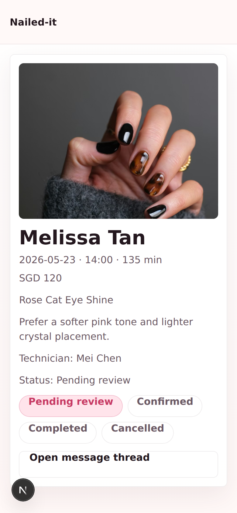
*Static span chips — ambiguous whether tappable.*

**After**

*Interactive radio toggle with hover, focus, active states. Selected option filled with accent color.*

---

### UI-E20 — Disabled CTA stronger affordance
**Type:** 🔧 Enhancement · **Status:** FIXED 2026-05-26 · **Priority:** P2

- **What:** `.button:disabled` rule used `opacity: 0.6` which left disabled CTAs looking similar to enabled. The "Analyze my photo" button on `/customer/booking` was the visible failure — barely distinguishable from active.
- **Why it matters:** Disabled state must telegraph "you can't use this yet". Subtle opacity invites accidental taps and false expectations.
- **Fix applied:**
  - (frontend `src/app/globals.css`): `.button:disabled` opacity tightened from `0.6` to `0.4`, added `box-shadow: none` and `filter: grayscale(0.3)`. Cumulative effect makes disabled state unmistakable on mobile.
- **Trade-off:** Slightly heavier visual treatment may look harsh in branded UI. Acceptable — disabled is intentionally distinguishable.
- **Must remain true:** All button variants share the disabled rule — primary, secondary, ghost — so the affordance is consistent.

**Before**

*Disabled "Analyze my photo" only ~40% lighter than enabled state.*

**After**
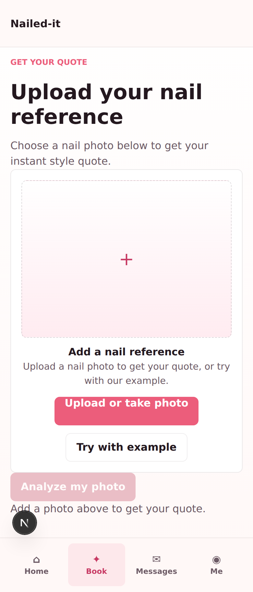
*Disabled is now clearly inert — heavy fade + grayscale.*

---

### UI-E19 — Merchant manage sticky save bar
**Type:** 🔧 Enhancement · **Status:** FIXED 2026-05-26 · **Priority:** P2

- **What:** Merchant manage screen (`/merchant/manage`) rendered ~30 form fields with the "Save price list" button sitting at the very bottom — after a long scroll, with no indication whether any changes were unsaved.
- **Why it matters:** Per persona Auntie Wang's "one-handed, on-the-job" usage pattern, the save button must be reachable while editing. No dirty-state signal means it's easy to navigate away and lose changes.
- **Fix applied:**
  - (frontend `src/app/merchant/manage/page.tsx`): Added `dirty` state — flips to `true` on any rule update, back to `false` on save. Save button text + state derived from `dirty`.
  - (frontend): Wrapped save button in a `.pricing-save-bar` with status text on the left ("Unsaved changes" / "All changes saved"). Bar uses `position: sticky` bottom-offset above tab bar.
  - (frontend `src/app/globals.css`): `.pricing-save-bar` + `[data-dirty='true']` variant (accent border + soft bg). `.pricing-save-status` color flips on dirty.
- **Trade-off:** Sticky element takes ~3rem of viewport. Worth it — Auntie Wang would otherwise scroll endlessly to find save.
- **Must remain true:** Dirty state must reset to `false` only after a successful save. Future autosave should keep this contract.

**Before**
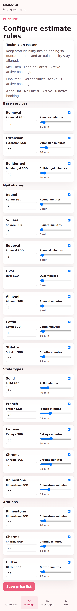
*Save button buried at end of long form. No dirty indicator.*

**After**
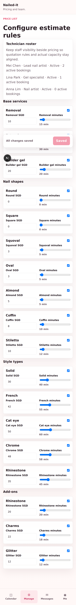
*Sticky save bar with dirty/clean status text. Save disabled when no changes.*

---

### UI-E18 — Style detail read-only tag treatment
**Type:** 🔧 Enhancement · **Status:** FIXED 2026-05-26 · **Priority:** P2

- **What:** Style detail panel's "Style details" section listed informational tags (Base, Shape, Style, Add-ons) using the same pink `.style-tag` pill treatment used elsewhere for interactive chips. Customers couldn't tell whether the tags were tappable filters or descriptive labels.
- **Why it matters:** Pink-pill = "tap me" in this product. Using the same treatment for read-only metadata creates a false affordance — Lens B-#4 consistency violation.
- **Fix applied:**
  - (frontend `src/features/customer/StyleDetailPanel.tsx`): Added `style-tag-readonly` modifier class to all tag spans inside the detail-selection-group.
  - (frontend `src/app/globals.css`): New `.style-tag-readonly` rule — neutral muted background, text-color body, `cursor: default`. Visually distinct from pink interactive chips.
- **Trade-off:** Drops some visual energy from the panel. Acceptable — accuracy beats brand color load.
- **Must remain true:** Any tag that does nothing on tap must use `.style-tag-readonly`. Future interactive filter chips keep the pink variants.

**Before**

*Pink chips on style detail looked like interactive filters.*

**After**
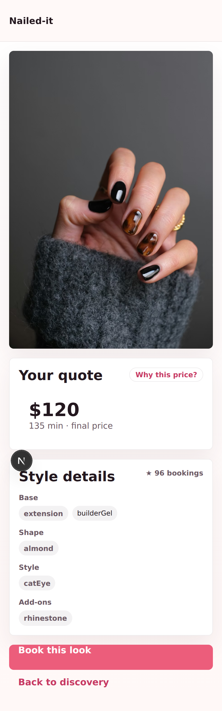
*Read-only neutral tags clearly informational.*

---

### UI-E17 — Style card score badge
**Type:** 🔧 Enhancement · **Status:** FIXED 2026-05-26 · **Priority:** P2

- **What:** Style discovery cards rendered the popularity score as `{value}%` (e.g. `80%`) in a small badge at the card corner. The bare percent next to a price ($45 — $120) read as a discount label — a universal e-commerce affordance that Nailed-it does not offer.
- **Why it matters:** False discount signal damages trust and conversion. Customers who tap expecting a sale find the same price; they discount the rest of the product as misleading.
- **Fix applied:**
  - (frontend `src/features/customer/StyleCard.tsx`): Replaced `{score}%` with `★ {score}` and added `aria-label="<n> recent bookings"`. Same data, different affordance — star icon reads as popularity / favorites, not discount.
- **Trade-off:** Star is a slightly weaker signal than a bold number. Acceptable — the alternative is misleading.
- **Must remain true:** No customer-facing surface should display a bare `{number}%` near a price unless the number is a real discount.

**Before**

*Cards showed "80%", "60%" beside prices — read as discounts.*

**After**

*Star + count clearly indicates popularity, not discount.*

---

### UI-E16 — Style detail popularity tooltip
**Type:** 🔧 Enhancement · **Status:** FIXED 2026-05-26 · **Priority:** P2

- **What:** Style detail "Popularity 96" label rendered a bare number with no unit. Customer could not tell whether 96 was a percentile, a rank, a count, or arbitrary.
- **Why it matters:** Recognition heuristic — label without meaning is anti-content. Per Lens B-#2 audit.
- **Fix applied:**
  - (frontend `src/features/customer/StyleDetailPanel.tsx`): Replaced static `Popularity {score}` with a `<Tooltip>`-wrapped button reading `★ {score} bookings`. Tooltip content: "Booked by {n} customers in the last 30 days."
  - (frontend `src/app/globals.css`): `.detail-popularity-info` — borderless button, muted color default, accent on hover/focus, `cursor: help`.
- **Trade-off:** Adds another tooltip on the detail page. Acceptable — same `@radix-ui/react-tooltip` instance already used by UI-E9's price disclosure.
- **Must remain true:** Any score / metric label without an obvious unit must be wrapped in a tooltip explaining what it measures.

**Before**

*"Popularity 96" — no unit, no meaning.*

**After**
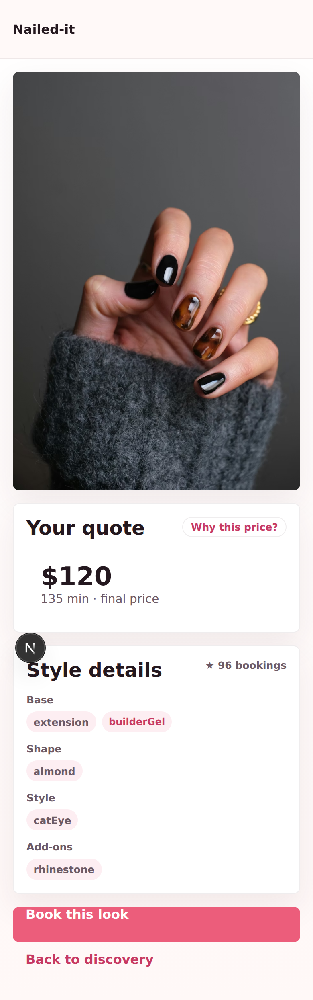
*Star icon + booking count, tooltip explains the metric on tap.*

---

### UI-E15 — Merchant calendar today card CTA
**Type:** 🔧 Enhancement · **Status:** FIXED 2026-05-26 · **Priority:** P2

- **What:** Merchant calendar today summary card rendered a single CTA "Open pricing rules" — wrong action for a calendar surface. Auntie Wang opens the calendar to see today's appointments, not to edit pricing.
- **Why it matters:** Lens A spec compliance — CTA must match user's reason for being on the screen.
- **Fix applied:**
  - (frontend `src/app/merchant/calendar/page.tsx`): Reworded body from `"Use the calendar to inspect daily workload, then switch to manage when pricing rules need tuning."` → `"Tap today on the calendar to see the sheet. Adjust pricing if a rule needs tuning."` Action-first, calendar-first.
  - (frontend): Demoted "Open pricing rules" button from `button-secondary` → `button-ghost`; relabelled to "Pricing rules".
- **Trade-off:** Pricing rules CTA is less visually heavy. Acceptable — calendar surface is for scheduling, not pricing.
- **Must remain true:** Today summary card's primary affordance is the calendar grid itself. Auxiliary CTAs stay ghost.

**Before**
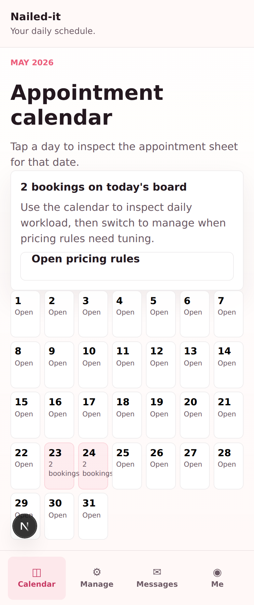
*"Open pricing rules" rendered as only CTA — misaligned with calendar intent.*

**After**
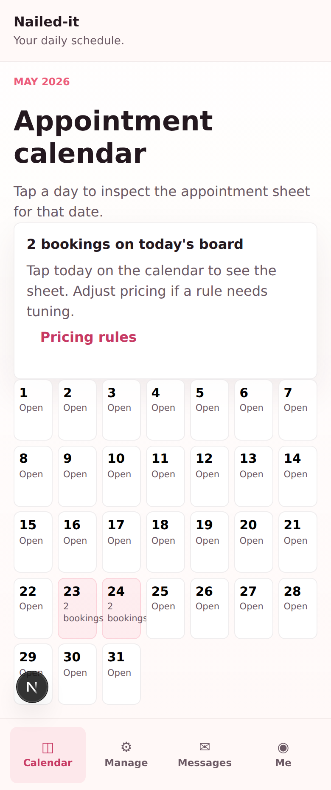
*Body copy points at the calendar; pricing rules is a ghost link.*

---

### UI-E14 — Conversation not-found copy
**Type:** 🔧 Enhancement · **Status:** FIXED 2026-05-26 · **Priority:** P2

- **What:** Both `/customer/messages/[id]` and `/merchant/messages/[id]` rendered engineer-flavored not-found copy when a conversation id was invalid: "The requested booking conversation is not available in the current mock dataset" (customer) and "The selected customer thread is not available in the current merchant inbox snapshot" (merchant). Both leak "mock", "dataset", "snapshot" — dev terms.
- **Why it matters:** Per content-style.md banned-words. Real users see "mock dataset" and either think the app is broken or are confused about what a snapshot is.
- **Fix applied:**
  - (frontend `src/app/customer/messages/[conversationId]/conversation-client.tsx`): Body → `"We couldn't find that conversation. Try the list again."`
  - (frontend `src/app/merchant/messages/[conversationId]/conversation-client.tsx`): Body → `"We couldn't find that thread. Try the inbox again."`
- **Trade-off:** New copy doesn't mention why the conversation is missing. Acceptable — user doesn't need internal cause, only the next action.
- **Must remain true:** No customer- or merchant-facing copy may reference internal architecture terms ("mock", "dataset", "snapshot", "fixture", "session").

**Before**
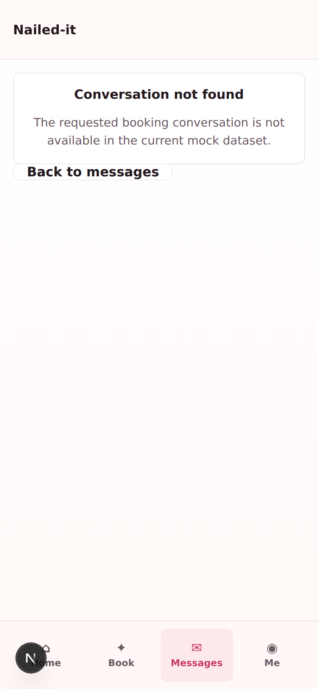
*Customer-side leaked "mock dataset".*

**After**
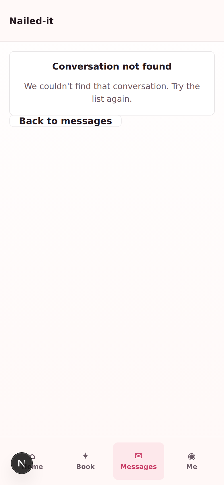
*Clean copy with single back-link CTA implied via header.*

---

### UI-E13 — Booking confirm empty state copy
**Type:** 🔧 Enhancement · **Status:** FIXED 2026-05-26 · **Priority:** P2

- **What:** `/customer/booking/confirm` rendered an engineer-y empty state when no booking draft existed: headline "Booking draft unavailable", body "Start from the booking step so the current recognition result and estimate can be carried into confirmation", CTA "Back to booking".
- **Why it matters:** "Booking draft", "recognition result", "carried into confirmation" — all dev terms. Lens B-#10 (Help users recover from errors) — copy should guide forward, not describe internal state.
- **Fix applied:**
  - (frontend `src/app/customer/booking/confirm/page.tsx`): Headline → `"Pick a style first"`. Title → `"No style selected yet"`. Body → `"Choose a look from the home page or upload your own photo to see your quote, then come back here to lock in the time."` CTA label → `"Start booking"`.
  - (test `src/app/customer/booking/confirm/page.test.tsx`): Updated both assertions to match new copy.
- **Trade-off:** New body is slightly longer than the previous one-liner. Acceptable — guides the user through two paths (home or upload).
- **Must remain true:** No copy on this page may use the term "draft" or "recognition" customer-facing.

**Before**
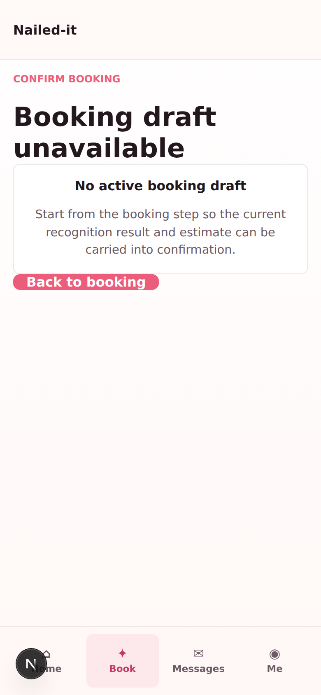
*"Booking draft unavailable" / "No active booking draft" / "carried into confirmation" — engineer copy.*

**After**
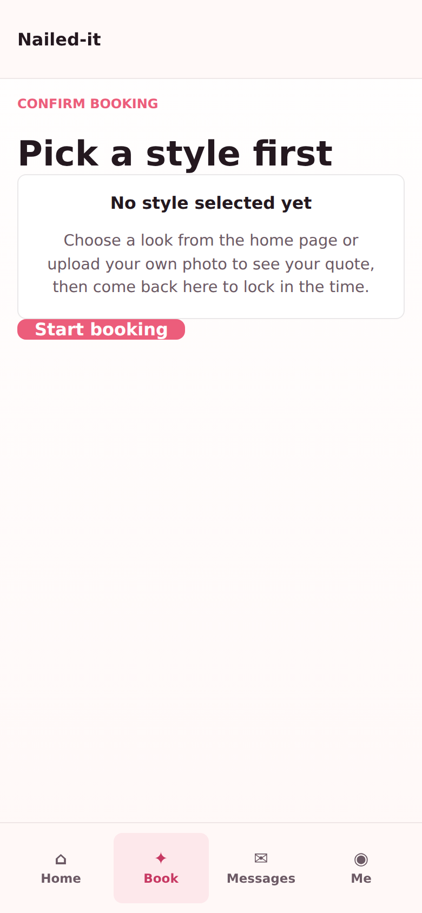
*Action-first headline; two paths spelled out in body; CTA is "Start booking".*

---

### UI-E12 — Customer home hero headline
**Type:** 🔧 Enhancement · **Status:** FIXED 2026-05-26 · **Priority:** P1

- **What:** Customer home hero rendered "Trending sets for your next appointment" — a generic taxonomy label that described the section's content type (trending sets) but did not trigger Yuki's job-to-be-done (pick a look that will work on her, get the price, book).
- **Why it matters:** The home hero is the user's first impression after entering the customer surface. The headline must tell users what they can do here, not categorize the inventory. Yuki and Mira both walk in with a task in mind: "see if this style works, what does it cost". The old copy did not connect to that task.
- **Fix applied:**
  - (frontend `src/app/customer/home/page.tsx`): Replaced headline `"Trending sets for your next appointment"` → `"Pick a look. Get an instant quote."`
  - (frontend `src/app/customer/home/page.tsx`): Replaced subhead `"Tap any style to see your quote, or book from your own photo."` → `"Tap any style for the price and time. Or upload your own photo to start."` Slight rewrite for parallel structure with new headline and to surface "time" alongside price (matches Mira's speed JTBD).
- **Trade-off:** Loses the "trending" signal in the hero. Acceptable — `StyleWaterfallGrid` heading below still reads "Discover trending nail looks", and each card surfaces a Trending NOW eyebrow when relevant.
- **Must remain true:** The headline must always tell the user what they can do, not what content this section contains. Future headline iterations must keep verb-led, ≤ 8-word structure per content-style.md.

**Before**
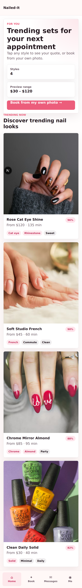
*Hero headline read "Trending sets for your next appointment" — taxonomy label, not a task trigger.*

**After**
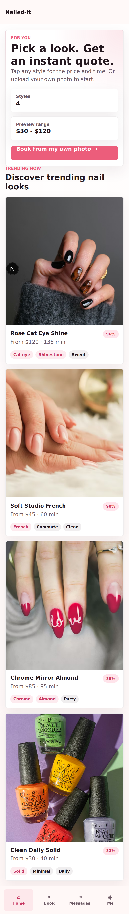
*Hero now reads "Pick a look. Get an instant quote." Verb-led, JTBD-aligned, parallel-structure subhead.*

---

### UI-E11 — Upload CTA hierarchy on booking page
**Type:** 🔧 Enhancement · **Status:** FIXED 2026-05-26 · **Priority:** P1

- **What:** Customer booking upload area rendered both "Upload or take photo" and "Try with example" as primary pink buttons when no image was loaded. Two adjacent primary CTAs gave the user no visual signal which action was preferred.
- **Why it matters:** Equal-weight CTAs split user attention and slow first-touch. "Upload or take photo" is the real path; "Try with example" is the escape hatch for users who don't have a photo handy. Hierarchy should match intent.
- **Fix applied:**
  - (frontend `src/components/ui/ImageUploader.tsx`): Hard-coded "Try with example" Button variant to `secondary` regardless of `hasImage` state. Removed the conditional `variant={hasImage ? 'secondary' : 'primary'}`. Upload-file label keeps `button-primary`.
- **Trade-off:** Users without a photo lose the equal visual nudge toward the example. Acceptable — first-time users overwhelmingly land here intending to upload their own; example button is still clearly tappable as secondary.
- **Must remain true:** "Upload or take photo" is the only primary CTA on the upload card. Future variants of `ImageUploader` (try-on, virtual fit, batch upload) must keep this rule.

**Before**
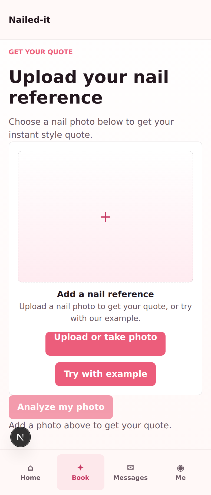
*Both upload CTAs rendered as primary pink — no hierarchy.*

**After**
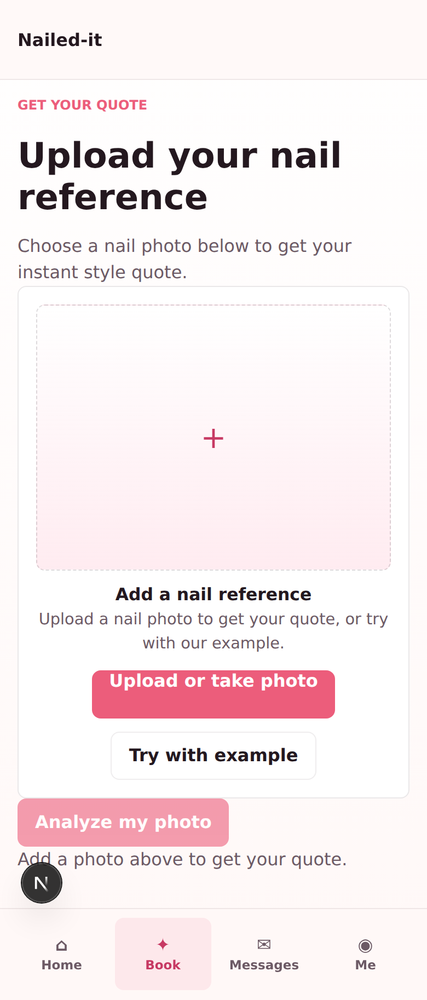
*Upload is primary pink; Try with example is secondary outline.*

---

### UI-E10 — Merchant booking status human labels
**Type:** 🔧 Enhancement · **Status:** FIXED 2026-05-26 · **Priority:** P1

- **What:** Merchant booking detail page rendered raw enum values (`pending_review`, `confirmed`, `completed`, `cancelled`) directly to the UI, both in the "Status: pending_review" line and in every status chip. Database enum was leaking through the display layer.
- **Why it matters:** Snake_case is engineering language. Real merchants see `pending_review` and either guess what it means or read it as buggy. Per content-style.md, no developer-facing terminology should reach the user.
- **Fix applied:**
  - (frontend `src/app/merchant/booking/[id]/booking-detail-client.tsx`): Added `statusLabels` record mapping each `Booking['status']` value to its human form: `pending_review → "Pending review"`, `confirmed → "Confirmed"`, `completed → "Completed"`, `cancelled → "Cancelled"`.
  - (frontend): Both the inline "Status:" text and the chip row now render via `statusLabels[status]`. Underlying enum stays unchanged in domain + mock — purely a display-layer mapping.
  - (test `src/app/merchant/booking/[id]/page.test.tsx`): Updated assertion from `/status: pending_review/i` → `/status: pending review/i`.
- **Trade-off:** A second source of truth for status names. Mitigation: keep the map adjacent to the enum constant; one TS-checked source of all labels.
- **Must remain true:** No `Booking['status']` enum value should reach any merchant-facing rendered surface as a raw string. All future status surfaces (calendar tiles, profile workload, message threads) must route through `statusLabels`.

**Before**

*Status chips rendered the raw snake_case enum — pending_review, confirmed, completed, cancelled.*

**After**

*Chips and inline status now read "Pending review", "Confirmed", "Completed", "Cancelled".*

---

### UI-E9 — Style detail single final price
**Type:** 🔧 Enhancement · **Status:** FIXED 2026-05-26 · **Priority:** P1

- **What:** Style detail pricing snapshot showed two competing prices: "Preview quote $120 (based on current pricing rules)" and "AI suggestion $100 (from the recognition result)". Customers could not tell which was the actual price they would pay.
- **Why it matters:** Customers walk away from any flow that surfaces conflicting numbers — especially a price. Showing both treats internal AI signal as customer-facing data.
- **Fix applied:**
  - (frontend `src/features/customer/StyleDetailPanel.tsx`): Removed dual-card grid. Display only the merchant-binding `previewQuote.price` as the single, large final number ($120, 135 min).
  - (frontend): AI suggestion + match confidence moved behind a "Why this price?" pill button. Wraps `@radix-ui/react-tooltip` (per ADR-0002). Tooltip text: "AI estimated $X for Y min based on the image. The merchant applied current pricing rules to set the final number. Match confidence: Z%."
  - (frontend `src/app/globals.css`): Added `.detail-final-quote` (large display number) and `.detail-price-info` (pill button) styles. Removed reliance on grid card layout for pricing area.
- **Trade-off:** AI suggestion is now one tap away rather than always-visible. Users who want the signal must opt in. This is the right default — most users want one price, not two.
- **Must remain true:** The displayed price must always be the merchant's binding price (`style.previewQuote.price`). AI suggestion must never appear as a primary number anywhere customer-facing.

**Before**

*Two price cards — Preview quote $120 vs AI suggestion $100 — created confusion about which was final.*

**After**

*Single $120 final price as large display number. "Why this price?" pill reveals AI suggestion + confidence on tap.*

---

### UI-E8 — Style detail CTA hierarchy
**Type:** 🔧 Enhancement · **Status:** FIXED 2026-05-26 · **Priority:** P1

- **What:** Customer style detail page rendered "Back to discovery" as the primary pink button and "Book this look" as the secondary outline button. CTA hierarchy was inverted — the conversion action looked weaker than the back-navigation.
- **Why it matters:** Style detail is the conversion screen. The booking CTA must be the strongest visual call to action. Inverted hierarchy means users mis-tap or never engage with booking, depressing conversion.
- **Fix applied:**
  - (frontend `src/features/customer/StyleDetailPanel.tsx`): Reordered detail-actions block so booking link renders first with `button button-primary`. "Back to discovery" demoted to `button button-ghost` (lower visual weight, still tappable).
- **Trade-off:** Ghost variant is less visually obvious than secondary. Users still see the back button below the primary CTA — back-navigation also lives in the top-bar brand link and browser back gesture.
- **Must remain true:** "Book this look" must always be the primary action on style detail. If `bookingIntent.href` is unavailable, fall back to the existing flow-note panel — never demote book again.

**Before**
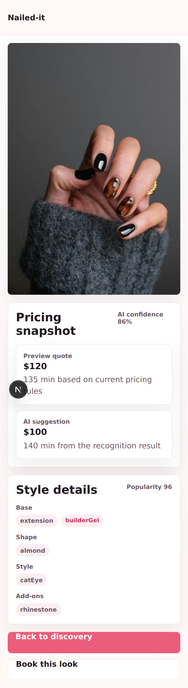
*Back to discovery rendered as primary pink, Book this look as outline secondary.*

**After**
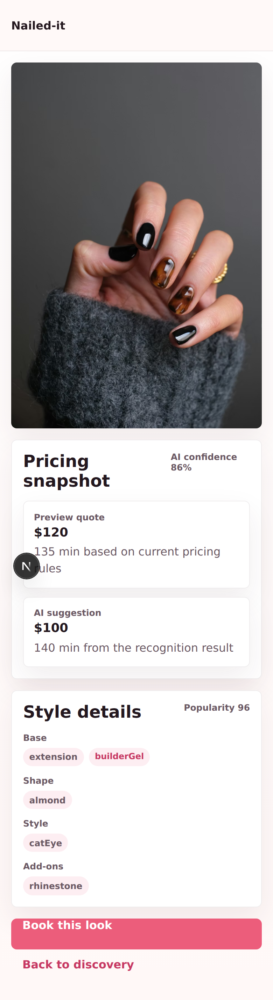
*Book this look is now the primary pink CTA. Back to discovery is a ghost button below.*

---

### UI-F1 — Booking entry CTA on discovery home
**Type:** ✨ Feature · **Status:** FIXED 2026-05-26 · **Priority:** P1

- **What:** The customer discovery home page shows trending style cards but provides no path for a user who wants to start a booking from their own photo. The only route to upload is the bottom tab "Book" — invisible to first-time users.
- **Why it matters:** The core product promise is "upload a photo → get a quote → book". A user who lands on the discovery home and doesn't see an upload CTA has no idea the feature exists. This is the primary user journey and it has no entry point.
- **Fix applied:**
  - (frontend): Add a sticky or inline hero CTA on `src/app/customer/home/page.tsx` — e.g. "Book from your own photo →" linking to `/customer/booking`.
  - (frontend): Consider a secondary CTA below the hero stats grid that reads "Have a style in mind? Upload your photo to get an instant quote."
  - (frontend): The discovery stat cards currently show "Styles: 6" and a price range. Replace or augment with a clear action card: "Start with your photo" pointing to the booking upload flow.
- **Trade-off:** Adds visual weight to the discovery hero. Keep it secondary to the trending grid — the grid is the first impression; the upload path is the conversion CTA.
- **Must remain true:** The upload path must remain accessible via the bottom tab "Book" as well — do not remove that entry point.

---

### UI-E7 — Landing page eyebrow and role-card copy
**Type:** 🔧 Enhancement · **Status:** FIXED 2026-05-26 · **Priority:** P3

- **What:** The landing page opens with eyebrow text "Mobile nail workflow" — engineering product-category language. The Customer role-card description includes "move straight into a booking flow" (same engineering term used as a button label throughout).
- **Why it matters:** The landing page is the first thing any judge, investor, or user sees. "Mobile nail workflow" reads as internal jargon. "Booking flow" is a dev term that should never appear in user copy.
- **Fix applied:**
  - (frontend `src/app/page.tsx`): Change eyebrow from `"Mobile nail workflow"` → `"AI nail booking"` or `"Your style, your way"`.
  - (frontend `src/app/page.tsx`): Customer description: `"Upload a reference, review the AI breakdown, and move straight into a booking flow."` → `"Upload a nail photo, get an instant style estimate, and book your appointment in minutes."`.
  - (frontend `src/app/page.tsx`): Merchant description: `"Keep pricing rules, appointment demand, and daily scheduling in one mobile workspace."` → `"View your daily schedule, manage pricing, and stay on top of every booking — all in one place."`.

---

### UI-E6 — Merchant page engineering copy sweep
**Type:** 🔧 Enhancement · **Status:** FIXED 2026-05-26 · **Priority:** P2

- **What:** Multiple merchant-facing pages expose internal architecture language to real merchant users.
- **Why it matters:** Merchants are salon owners / managers. Seeing "shared mock source", "mock operating model", "shared booking session" in the app UI is confusing and unprofessional.
- **Fix applied:**
  - (frontend `src/app/merchant/profile/page.tsx` line 58): `"Pricing and bookings stay connected through one mock operating model"` → `"Your pricing rules feed directly into customer estimates and booking totals."`.
  - (frontend `src/app/merchant/manage/page.tsx`): subtitle `"Tune the shared pricing rules that feed both customer estimates and merchant booking snapshots."` → remove subtitle or use `"Adjust your pricing rules — changes apply immediately to new estimates."`.
  - (frontend `src/app/merchant/calendar/page.tsx`): subtitle `"Monthly calendar, day sheet, and booking details all read from the shared booking session."` → remove or use `"Your full schedule at a glance."`.
  - (frontend `src/app/merchant/messages/*`): subtitles with "shared mock source" → remove.
  - (frontend `src/app/merchant/booking/[id]/page.tsx`): subtitle with "shared booking snapshot" → remove.

---

### UI-E5 — Discovery section engineering copy sweep
**Type:** 🔧 Enhancement · **Status:** FIXED 2026-05-26 · **Priority:** P2

- **What:** The customer discovery section and style detail views contain internal architecture descriptions in user-visible copy.
- **Why it matters:** Users see "Shared mock styles with live preview quotes from pricing rules" and "Add new mock styles to the shared source of truth" — both are developer-internal descriptions of the data architecture, not user-facing content.
- **Fix applied:**
  - (frontend `src/features/customer/StyleWaterfallGrid.tsx` line 19, 35): `"Shared mock styles with live preview quotes from pricing rules."` → remove entirely or use `"Prices update based on your selection."`.
  - (frontend `src/features/customer/StyleWaterfallGrid.tsx` line 21): Empty state body: `"Add new mock styles to the shared source of truth and this feed will populate automatically."` → `"No trending styles right now — check back soon."`.
  - (frontend `src/app/customer/home/page.tsx` line 35): eyebrow `"Customer home"` is an architectural role-label, not a user greeting → replace with `"For you"` or remove.
  - (frontend `src/app/customer/home/page.tsx` line 38): `"Browse live style previews before the booking flow is opened up."` → `"Tap any style to see your quote, or upload your own photo to get started."`.
  - (frontend `src/app/customer/style/[id]/page.tsx`): subtitle `"Detail view wired to the current mock recognition and quote contracts."` → remove (handled by UI-E1).

---

### UI-E4 — Privacy page Back button placement
**Type:** 🔧 Enhancement · **Status:** FIXED 2026-05-26 · **Priority:** P2

- **What:** The "Back to app" link on `/privacy` (`src/app/privacy/page.tsx` line 69) is a bare `button-secondary` link floating after the last policy card in the flex column. It has no container, no visual anchor, and no back-arrow to indicate navigation intent. The label "Back to app" is also vague — the page is publicly linked from external platforms where users may not know what "the app" refers to.
- **Why it matters:** Privacy page is shown to Pinterest reviewers and external users who may arrive directly via URL. The orphaned button looks unfinished and the label is ambiguous.
- **Fix applied:**
  - (frontend `src/app/privacy/page.tsx`): Wrap the back link in a footer container with proper padding and border-top, matching the visual language of the landing page.
  - (frontend `src/app/privacy/page.tsx`): Change label from `"Back to app"` → `"← Back to Nailed-it"` or `"Open Nailed-it →"`.
  - (frontend `src/app/privacy/page.tsx`): Style as `button-ghost` with a left-arrow prefix or as an inline text link rather than a secondary button — a secondary button implies an equal-weight action to the page content, which it isn't.

---

### UI-E3 — Style detail panel copy and CTA label
**Type:** 🔧 Enhancement · **Status:** FIXED 2026-05-26 · **Priority:** P2

- **What:** `StyleDetailPanel` exposes two engineering terms to customers: (1) the section heading "Recognized attributes" describes an internal AI step, not a user concept; (2) the primary CTA label comes from `session.ts` as `"Booking flow"` — an engineering identifier, not an action users understand.
- **Why it matters:** The style detail is the conversion screen — where a customer decides whether to book. "Recognized attributes" and "Booking flow" undermine trust and clarity at the most critical decision point.
- **Fix applied:**
  - (frontend `src/features/customer/StyleDetailPanel.tsx` line 61): `"Recognized attributes"` → `"Style details"` or `"What we detected"`.
  - (domain `src/domain/session.ts` line 65): customer booking intent label `"Booking flow"` → `"Book this look"`.
  - (domain `src/domain/session.ts` line 80): booking intent note `"Customer booking starts with a mock upload and AI recognition pass before time selection."` → `"Upload your photo to get an instant quote, then pick your time."` (this note is used in planned-state fallback UI).

---

### UI-E2 — Booking page engineering language sweep
**Type:** 🔧 Enhancement · **Status:** FIXED 2026-05-26 · **Priority:** P1

- **What:** The customer booking page (`src/app/customer/booking/page.tsx`) and `ImageUploader` component use engineering terminology throughout — in button labels, section titles, body copy, and the bottom sheet title. A first-time user on this page sees no clear user-facing language.
- **Why it matters:** Booking is the primary revenue action. Every piece of confusing copy increases drop-off. "Smart recognition", "mock image", "recognition contract", "AI recognition result" are internal system concepts that users should never encounter.
- **Fix applied:**
  - (frontend `src/app/customer/booking/page.tsx` line 88-89): Copy `"Start with a mock image now. The editable breakdown keeps the pricing logic tied to the current recognition contract."` → `"Choose a nail photo below to get your instant style quote."`.
  - (frontend `src/app/customer/booking/page.tsx` line 110): Button `"Smart recognition"` → `"Analyze my photo"`.
  - (frontend `src/app/customer/booking/page.tsx` line 105): Button `"Review AI breakdown"` → `"View your estimate"`.
  - (frontend `src/app/customer/booking/page.tsx` line 132): BottomSheet title `"AI recognition result"` → `"Your style breakdown"`.
  - (frontend `src/app/customer/booking/page.tsx` line 133-135): Helper copy `"Review the extracted attributes. The rule-based estimate updates immediately as you edit the recognition result."` → `"Adjust the style details below — your quote updates instantly."`.
  - (frontend `src/app/customer/booking/page.tsx` line 122): Section `"Current recognition snapshot"` → `"Style detected"`.
  - (frontend `src/components/ui/ImageUploader.tsx` line 58): Copy `"Upload a nail photo for live recognition, or use the sample for local flow testing."` → `"Upload a nail photo to get your quote, or try with our example."`.
  - (frontend `src/components/ui/ImageUploader.tsx` line 72): Button `"Use sample image"` → `"Try with example"`.
  - (frontend `src/app/customer/booking/page.tsx` line 110): Add helper text under the disabled "Analyze" button when `!imageUrl`: `"Add a photo above to get your quote."`.

---

### UI-E1 — Replace all page subtitle engineering notes with UX copy
**Type:** 🔧 Enhancement · **Status:** FIXED 2026-05-26 · **Priority:** P1

- **What:** Every `MobileLayout` call passes a `subtitle` prop that contains an internal developer description of the page's architectural role. These strings are rendered in the `TopBar` as muted text visible to all users on every page. 14 pages are affected.
- **Why it matters:** The subtitle is the first contextual text users read after the page title. Engineering notes like "Discovery feed built from the shared mock style source of truth", "Detail view wired to the current mock recognition and quote contracts", and "This lightweight flow keeps the current booking draft in memory until you move into confirmation" destroy user trust and make the app look unfinished.
- **Fix applied:** For each page, either (a) remove the subtitle entirely (no subtitle is better than a dev note), or (b) replace with genuine short UX copy. Recommended approach per page:
  - `customer/home`: remove subtitle (the hero h1 is sufficient).
  - `customer/booking`: `"Get your nail quote in seconds."`.
  - `customer/booking/confirm` (both states): `"Choose your time and technician."`.
  - `customer/style/[id]`: remove subtitle.
  - `customer/messages`: remove subtitle.
  - `customer/messages/[conversationId]`: remove subtitle.
  - `customer/profile`: remove subtitle.
  - `merchant/calendar`: `"Your daily schedule."`.
  - `merchant/manage`: `"Pricing and team."`.
  - `merchant/booking/[id]`: remove subtitle.
  - `merchant/messages`: remove subtitle.
  - `merchant/messages/[conversationId]`: remove subtitle.
  - `merchant/profile`: remove subtitle.
- **Must remain true:** `TopBar` should still accept a `subtitle` prop for future use — just stop passing dev notes into it.

---

## Backend API

*(no entries yet)*

---

## AI Features

*(no entries yet)*

---

## Documentation

*(no entries yet)*

---

## Technical

*(no entries yet)*

---
